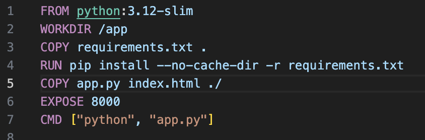
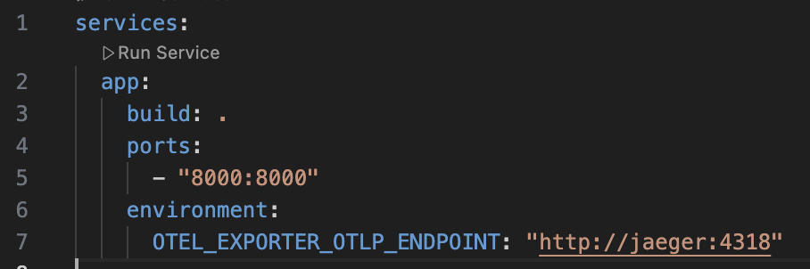

### Часть 1 - Создание сервиса
________________
Я создала небольшой HTTP-сервис на Python с помощью GPT. Изначально мне было непонятно, что конкретно происходит в приложении, поэтому я начала разбираться в его структуре.

При открытии приложения браузер отправляет HTTP-запрос, а программа возвращает HTML-страницу с тремя кнопками.

В приложении используются следующие эндпоинты:

`POST /api/error` — возвращает ошибку со статусом 500; \
`POST /api/delay` — отвечает с задержкой от одной до трёх секунд; \
`POST /api/load` — создаёт пачку запросов к самому сервису; \
`GET /metrics` — возвращает метрики Prometheus; \
`GET /healthz` — проверяет работоспособность приложения; \
`GET /` — возвращает главную страницу. \

Затем я перешла к изучению созданного Dockerfile. Мне все было понятно, кроме строчек: \
`ENV PYTHONDONTWRITEBYTECODE=1!` \
`PYTHONUNBUFFERED=1!` \

Поэтому я решила их убрать. Сам Dockerfile стал выглядеть так:

Затем я перешла к просмотру docker-compose. Там была переменная окружения для отправки трейсов, так как я еще не дошла до коллектора я решила на время закомментить эту строчку. Сам docker-compose стал выглядеть так:

