# Часть 1 - Создание сервиса 
### Что у вас здесь происходит?

________
Я создала сервис с помощью гпт, но так как я не понимаю, что он создал, зачем, как и почему, я решила разобраться в самой базе, инфраструктуре, что и как связано. 

При открытии страницы приложения происходит следующее: браузер отправляет запрос типо дай мне страницу, программа принимает запрос, после этого она возвращает ему описание страницы в HTML и в результате браузер отображает страницу с кнопками. 

В ходе изучении теории я столкнулась со словом “эндпоинт” и с гпт никак не могла понять, что это такое и с чем его едят, поэтому я нашла оч крутую статью про api, в которой и рассказывается про него https://habr.com/ru/articles/964818/?ysclid=mtix7a3svi740460420

Изначально мне было непонятно, как работает приложение внутри, поэтому я разобрала его функции, эндпоинты, как они задаются и вызываются. Затем я перешла к изучению докерфайла, в нем мне все было понятно, кроме строчек 

`ENV PYTHONDONTWRITEBYTECODE=1!` \
`PYTHONUNBUFFERED=1!` \
`USER 10001:10001` <br/>

Я разобрала эти строки и первая отвечает за то, что при импорте модулей кеш не будет записываться и отключается буферизация. Вторая строчка отвечает за пользователя и группу, с какими правами будет работать программа внутри. Я пока что не понимаю смысл этих строчек, поэтому я решила их убрать, оставив такой код:

```yml
FROM python:3.12-slim
WORKDIR /app
COPY requirements.txt .
RUN pip install --no-cache-dir -r requirements.txt
COPY app.py index.html ./
EXPOSE 8000
CMD ["python", "app.py"]
```

Потом я залезла в docker-compose и начала разбирать в нем код. Я понимаю, что в нем происходит, но я не понимаю смысл переменных окружения и хелфчеков (я понимаю что хелфчеки проверяют периодически приложение, но конкретно в этой ситуации зачем он нужен?). Такие переменные окружения он создал: 
` “OTEL_SERVICE_NAME: red-demo” `
, просто указывается использование конкретного имени в логах и трейсах, но в самом файле программы уже используется это имя по умолчанию, поэтому я удалила эту строчку. Еще одна строчка с переменной окружения 
` “OTEL_EXPORTER_OTLP_ENDPOINT: "${OTEL_EXPORTER_OTLP_ENDPOINT:-}"” `
, я прочитала про нее, она нужна для джаегера, а этот джагегер еще и опентелеметри, че за слова…

Короче я начала разбирать что все это значит, и сейчас я понимаю, почему в файле зависимостей написано про библиотеку опентелеметри, именно она будет создавать записи об операциях, а джагегер является хранилищем, которое позволяет эти записи просматривать. Еще мне непонятно, почему прописывается именно такая переменная в докер композ, поэтому я решила почитать код app.py. Я нашла блок кода, который отвечает за отправку трейсов, даже если они не будут объявлены:

```python
provider = TracerProvider(
    resource=Resource.create({"service.name": SERVICE}), sampler=ALWAYS_ON
)
EXPORT_ENABLED = bool(os.getenv("OTEL_EXPORTER_OTLP_TRACES_ENDPOINT") or
                      os.getenv("OTEL_EXPORTER_OTLP_ENDPOINT"))
if EXPORT_ENABLED:
    provider.add_span_processor(BatchSpanProcessor(OTLPSpanExporter()))
trace.set_tracer_provider(provider)
tracer = trace.get_tracer("red-demo")

REQUESTS = Counter("http_requests_total", "Completed HTTP requests",
                   ["method", "route", "status"])
ERRORS = Counter("http_errors_total", "HTTP responses with status 5xx",
                 ["method", "route"])
DURATION = Histogram("http_request_duration_seconds", "Handler duration in seconds",
                     ["method", "route"],
                     buckets=(0.005, 0.01, 0.025, 0.05, 0.1, 0.25, 0.5, 1, 2, 3, 5, 10))
```

Здесь проверяется существование переменной, и затем возвращается булевое значение, если оно равно true, то будет выполняться блок с условием, где используется библиотека опентелеметри, все выполненные операции будут записываться и отправляться по адресу, указанному в переменной. 

Затем у меня появилось еще очень много вопросов, которые я себе выписывала и разбиралась в них, поэтому я решила не захламлять отчет и просто дальше пойти по заданию :)

Итоговый docker-compose для первой части:

```yml
services:
  app:
    build: .
    ports:
      - "8000:8000"
    #environment:
    #  OTEL_EXPORTER_OTLP_ENDPOINT: "http://jaeger:4318"
```

____________

### Проверка работы сервиса

________

Билжу образ и запускаю контейнер. На время комментирую переменные окружения, так как джаегера еще нет. Ввожу команду `docker compose up -d --build`

Получаю следующий результат:


Для проверки работы контейнера использую `docker compose ps` и смотрю результат:


Захожу на адрес http://127.0.0.1:8000 и появляется такая картинка:


Проверяю работу сервиса, нажимаю на кнопки и в терминале ввожу `docker compose logs -f`:


При нажатии на создание ошибки лог выводится сразу, при нажатии на задержку лог выводится с задержкой, что и видно по `"duration_seconds": 2.687324`, при нажатии на нагрузку выводится большое число логов.

Иду исследовать метрики, при нажатии на "Посмотреть метрики" открывается такая картинка:


Начинаю проверять их работу. Нажимаю 3 раза на создание ошибки, и вот результат до:


и вот результат после:


___________

# Часть 2 - Метрики
Ну погнали... 

Вопросы, с которыми я столкнулась:
> Что такое прометеус? \
> Что такое метрики? \
> Что такое графана? \
> Прометеус сам забирает метрики или их отправляет сервис app? \
> Что такое том и как он работает? \
> Почему для графаны мы не создаем файл? \
> Что такое RED? \
> Что такое p95? <br/>

Со всеми вопросами я разобралась и перешла к делу.

Создаю файл `prometheus.yml`, в котором будут написаны настройки сбора метрик, список заданий, эндпоинт и адрес для сбора

```yml
global:
  scrape_interval: 10s
scrape_configs:
  - job_name: red-demo
    metrics_path: /metrics
    static_configs:
      - targets:
          - app:8000
```

так как Prometheus это отдельный сервис, я перехожу в docker-compose для создания контейнера. Беру готовый образ, прописываю порт, так как был написан  `prometheus.yml` локально, с помощью `bind mount` делаю его доступным внутри контейнера. Так как Prometheus сохраняет данные в директории `/prometheus`, создаю именованный том `prometheus_data`, на случай, если контейнер будет пересоздан или удален. В результате получился такой блок в docker-compose:

```yml
 prometheus:
    image: prom/prometheus:v3.13.2
    ports:
      - "9090:9090"
    volumes:
      - ./prometheus.yml:/etc/prometheus/prometheus.yml:ro
      - prometheus_data:/prometheus

volumes:
  prometheus_data:
```

Изначально я хотела создать Dockerfile и вшить в него `prometheus.yml`, но гпт сказал, что это так себе идея, так как если я захочу что-либо поменять в нем, то придется и пересобирать образ и перезапускать контейнер. Поэтому я решила оставить так, как он предложил, просто подключить по пути `/etc/prometheus/prometheus.yml:ro` файл `yml` с правами для чтения, типо `bind mount`. 

Для проверки работы Prometheus я перезапускаю docker-compose командами: `docker compose down`, `docker compose up -d`

> p. s. \
> только потом я узнала, что можно было просто написать `docker compose up -d prometheus` 😐 <br/>

Смотрю результат:


Перехожу по адресу http://127.0.0.1:9090 


В нем можно даже зайти и посмотреть состояние сервиса на порту 8000, где он будет писать последний сбор данных


Чтобы проверить его работу, в сервисе app нажимаю `Ошибка`, смотрю название метрики `http_requests_total` и записываю в поиск Prometheus, в итоге он вывел:


Смотрю график:


Перехожу к созданию Grafana. В docker-compose добавляю блок:

```yml
  grafana:
    image: grafana/grafana:13.2.1
    ports:
      - "3000:3000"
    volumes:
      - grafana_data:/var/lib/grafana

volumes:
  prometheus_data:
  grafana_data: 
```

Проверяю работу контейнеров:


перехожу на http://127.0.0.1:3000/ пишу admin admin и меняю пароль. 


перехожу в соединения, создаю связь, прописываю адрес `http://prometheus:9090` и сохраняю, перехожу в показатели и ТАМ:


я поражена. прикольно.

Для проверки работы я начала создавать ошибки в сервисе app и перешла к наблюдению за графиками:


_________

RED – requests, errors, durations

Создаю дашборд и устанавливаю для `requests` значения и операции по счетчику обработанных запросов `http_requests_total`:


Я понажимала на кнопки в сервисе app, но на графике был плохо заметен результат. Потом я увидела, что можно вместо `last 6 hours` поставить `last 5 minuts`, что я и сделала, потом опять возникла незначительная проблема, я нажимала на нагрузку, и он ничего не выводил даже после `refresh`, только потом до меня дошло, что надо было просто нажать `move`… треш 🫤


Теперь добавляю на панель долю ошибок. Вставляю код для счетчика ошибок, где ошибочные запросы будут делиться на сумму всех запросов и умножаться на сто


Нажимаю на ошибку, задержку, нагрузку и смотрю результат:


Тут видно что доля ошибок уменьшалась с 1.4 % до 0.4 %

После этого перехожу к durations:


___________

# Часть 3 - Логи

`Подними Loki и агент Promtail` поднять Локи? Стоп... Локи..? 


______

> В этой части будет много мыслей, возражений и поражений

Я прочитала, что Loki хранит логи, а Promtail доставляет записи, но у меня возник вопрос типо `лол, а зачем нам это вообще нужно, если можно просто через терминал посмотреть логи?` Но гпт выдал, что если много сервисов и нужно просматривать каждый, то будет неудобно. Пон. 

Чтобы сразу не получать готовый ответ, я начала думать, если Loki хранит информацию, значит ему нужны `volumes`, если Promtail берет логи из сервиса, значит ему нужно знать, откуда брать и куда отправлять, поэтому ему нужен файл, если Promtail ничего не хранит, значит том ему не понадобится. Ну и соответственно нужно добавить сервисы в `docker-compose`, прописать `image` и `ports`. 

Ага… я прочитала, что Loki нужен конфиг, но можно обойтись и без него, так как он является хранилищем, но он должен понимать, от кого принимать логи. А про Promtail, ему можно добавить том, чтобы при перезапуске он понимал, на каком месте он остановился.

В `docker-compose` я натыкала для Loki `ports`, `image` и `volumes`, практически все одинаково, как и в Prometheus, только `image` я взяла из гпт. Единственное, чем отличался блок Loki от Prometheus это тем, что в нем появилась команда:

```yml
command: ["-config.file=/etc/loki/loki.yml"]
```

 которая указывает, какой файл прочитать при запуске контейнера. Мне стало непонятно, зачем писать эту команду, если у нас есть такая строчка в `volumes`:
 
 ```yml
 “- ./loki.yml:/etc/loki/loki.yml:ro”
```

 которая делает итак файл доступным для чтения внутри контейнера. 

 > Стадия бешенства <br/>

 Тупой чат гпт он мне добавил эту строчку `“command: ["-config.file=/etc/loki/loki.yml"]”` и не смог блин нафиг объяснить что она значит и почему конкретно ее мы добавляем. В итоге я его замучала вопросами `че за бред?` и он выдал типо `сори нам не нужна эта строчка`. Оказывается, что в образе, который я подключила, файл запускается с другим названием, поэтому он мне предложил добавить этот `command`. Пошел нафиг чат гпт, буду теперь сама искать и читать Dockerfile для сервисов. Поэтому я просто меняю строчку 
 ```yml
 ./loki.yml:/etc/loki/loki.yml:ro 
 ```
 на 
 ```yml
 ./loki.yml:/etc/loki/local-config.yaml:ro
```
и удаляю `command`

> Стадия принятия  <br/>

Я перешла к изучению Promtail уже без гпт, я нашла образ 3.6.11, посмотрела его Dockerfile и там также есть файл настройка config.yaml. Над ним скорее мне придется работать и нужно будет его создавать. Также я поглядела разные docker-compose на гитхабе, некоторые в своем коде пишут `command`, и я поняла, что не так страшно его использовать, тем более я уже с ним знакома, поэтому я решила его вернуть 😁

Я начала прописывать блок Promtail в docker-compose, конфиг `promtail.yaml` мне сделал гпт. Для того, чтобы проверить, правильно ли я написала блок в docker-compose, я его закинула в гпт, и тут я испугалась, потому что он мне написал еще такую строчку в 'volumes':

```yml
- /var/run/docker.sock:/var/run/docker.sock:ro
```

Но, как оказалось, все логично. Так как Promtail должен собирать и доставлять логи в Loki, ему необходимо знать, какие контейнеры запущены и откуда получать их записи. Для этого сокет Docker `docker.sock` делается доступным внутри контейнера Promtail. Через него Promtail обращается к Docker Engine, обнаруживает контейнеры и получает их логи.

В итоге блоки для Loki и Promtail получились такими:

```yml
  loki:
    image: grafana/loki:3.7.0
    command: ["-config.file=/etc/loki/loki.yml"]
    ports:
      - "3100:3100"
    volumes:
      - ./loki.yml:/etc/loki/loki.yml:ro
      - loki_data:/loki

  promtail:
    image: grafana/promtail:3.6.11
    command: -config.file=/etc/promtail/promtail.yaml
    volumes:
      - ./promtail.yaml:/etc/promtail/promtail.yaml:ro
      - promtail_data:/var/lib/promtail
      - /var/run/docker.sock:/var/run/docker.sock:ro

volumes:
  prometheus_data:
  grafana_data: 
  loki_data:
  promtail_data:
```

 _____________
 ### Запуск и проверка работы
 _________
> Пока что я сталкивалась только с ошибками по невнимательности, например вместо `yaml` я могла написать `yml`, и ошибки
> связанные с неправильно написанным `command` <br/>

Запускаю Promtail и Loki с помощью команды `docker compose up -d loki promtail`

> К сожалению, я забыла заскринить момент запуска, поэтому тут будет чилловый парень <br/>


По той же схеме подключаю к Grafana Loki, указываю `job=red-demo`, создаю ошибки, задержку и нагрузку, и смотрю на результат:

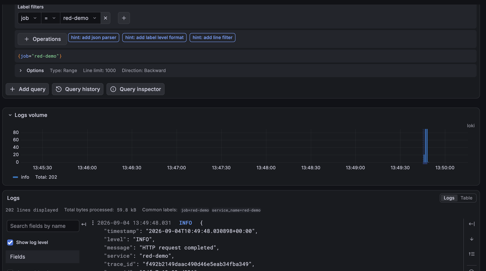

Все работает, логи получены, а это значит, что Promtail правильно передает записи.

Перехожу к третьему пункту в задании: `Нажми «Создать ошибку» и найди эту ошибку в логах.`

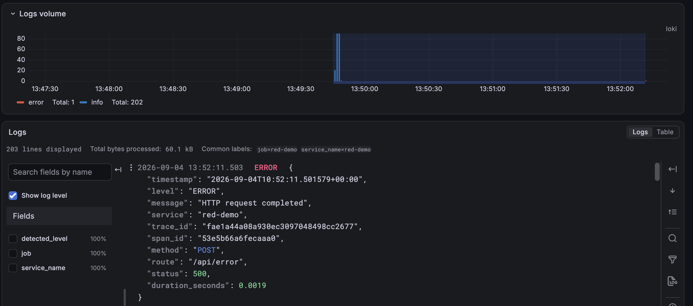

________

# Часть 4 — Трейсы 

> Информация для себя: \
> Trace – полный путь одного запроса \
> Span – одна операция внутри этого запроса <br/>

В файле зависимостей `requirements.txt` подключен `opentelemetry-sdk`

```yml
opentelemetry-sdk==1.39.1
opentelemetry-exporter-otlp-proto-http==1.39.1
```
Компоненты `opentelemetry-sdk` импортированы в файле app.py:

```python
from opentelemetry import trace
from opentelemetry.exporter.otlp.proto.http.trace_exporter import OTLPSpanExporter
from opentelemetry.propagators.textmap import default_getter
from opentelemetry.trace.propagation.tracecontext import TraceContextTextMapPropagator
from opentelemetry.sdk.resources import Resource
from opentelemetry.sdk.trace import TracerProvider
from opentelemetry.sdk.trace.export import BatchSpanProcessor
from opentelemetry.sdk.trace.sampling import ALWAYS_ON
from opentelemetry.trace import SpanKind, Status, StatusCode
```

Инструментирование, создание спана, запуск обработчика запросов:

```python
   with tracer.start_as_current_span(
        f"{method} {route}", context=parent, kind=SpanKind.SERVER,
        attributes={"http.request.method": method, "http.route": route},
    ) as span:
        try:
            response = await handler(request)
        except web.HTTPException as exc:
            response = web.json_response({"message": exc.reason}, status=exc.status,
                                         headers={k: v for k, v in exc.headers.items()
                                                  if k.lower() != "content-type"})
```

Вопросы, с которыми я столкнулась:
> Что такое инструментирование? \
> Что такое авто-инстурментирование? \
> Что такое HTTP-фреймворк? \
> Что такое входящий запрос? \
> Что такое корневой спан? \
> Как выполнение этих задач отражается в коде? \
> Что такое Jaeger? \
> Что означает all-in-one? \
> Что такое open telemetry collector? \
> Что такое телеметрия?
> Что такое OTLP? <br/>

_________________
### Обзор файла app.py на наличие всех пунктов из задания
______

- `В обработчике «задержки» оберни медленную операцию во вложенный спан (например, slow-dependency) — чтобы в водопаде было видно, что время ушло именно туда.`

```python
async def delay(request):
    seconds = random.uniform(1, 3)
    with tracer.start_as_current_span("slow-dependency", attributes={"delay.seconds": seconds}):
        await asyncio.sleep(seconds)
    return web.json_response({"message": "Задержка завершена", "delay_seconds": round(seconds, 3)})
```

- `В обработчике «ошибки» помечай спан как ошибочный (status = error) — Jaeger подсветит его.`

```python
        ERRORS.labels(method, route).inc(int(status >= 500))
        span.set_attribute("http.response.status_code", status)
        if status >= 500:
            span.set_status(Status(StatusCode.ERROR, f"HTTP {status}"))
```

- `Проставляй в логи trace_id текущего спана — так лог и трейс связываются.`

```python
        ctx = trace.get_current_span().get_span_context()
        data = {
            "timestamp": datetime.now(timezone.utc).isoformat(),
            "level": record.levelname,
            "message": record.getMessage(),
            "service": SERVICE,
            "trace_id": format(ctx.trace_id, "032x") if ctx.is_valid else None,
            "span_id": format(ctx.span_id, "016x") if ctx.is_valid else None,
        }
```

- `Экспортируй трейсы по протоколу OTLP — обычно адрес задаётся переменной OTEL_EXPORTER_OTLP_ENDPOINT.`

```python
EXPORT_ENABLED = bool(os.getenv("OTEL_EXPORTER_OTLP_TRACES_ENDPOINT") or
                      os.getenv("OTEL_EXPORTER_OTLP_ENDPOINT"))
if EXPORT_ENABLED:
    provider.add_span_processor(BatchSpanProcessor(OTLPSpanExporter()))
trace.set_tracer_provider(provider)
tracer = trace.get_tracer("red-demo")

REQUESTS = Counter("http_requests_total", "Completed HTTP requests",
                   ["method", "route", "status"])
ERRORS = Counter("http_errors_total", "HTTP responses with status 5xx",
                 ["method", "route"])
DURATION = Histogram("http_request_duration_seconds", "Handler duration in seconds",
                     ["method", "route"],
                     buckets=(0.005, 0.01, 0.025, 0.05, 0.1, 0.25, 0.5, 1, 2, 3, 5, 10))
```
__________
### Разбор Jaeger и OpenTelemetry
__________
Информация для себя:
> Jaeger - отдельное приложение, которое принимает трейсы от OpenTelemetry, хранит их, позволяет искать трейсы, показывает их через графический
> интерфейс.
> Обычно система Jaeger может состоять из отдельных компонентов: \
> Jaeger Collector — принимает трейсы \
> Jaeger Storage — хранит трейсы \
> Jaeger Query — ищет трейсы \
> Jaeger UI — показывает трейсы \
> а all-in-one объединяет их в одном процессе и в одном контейнере. <br/>

Открываю docker-compose и записываю туда блок для Jaeger:

```yml
  jaeger:
    image: jaegertracing/all-in-one:1.76.0
    environment:
      COLLECTOR_OTLP_ENABLED: "true"
    ports:
      - "16686:16686"
```

Включаю OTLP и прописываю порты. Сначала я думала, что нам понадобится том для хранения, но образ Jaeger уже настроен так, что он будет хранить трейсы в оперативной памяти

Информация для себя:
> OpenTelemetry Collector - отдельная программа посредник, которая принимает телеметрию от приложений , при необходимости обрабатывает ее,
> отправляет в нужную систему хранения. Приложение уже не будет отправлять данные уже напрямую в Jaeger.
> Конфигурация Collector содержит три основные части: \
> 1.	Receiver - принимает данные, слушает 4317, 4318 \
> 2.	Processor - обрабатывает данные. То есть он может собирать спаны в пачки, удалять ненужные атрибуты, добавлять атрибуты, фильтровать данные, ограничивать использование памяти. \
> 3.	Exporter - отправляет данные дальше, здесь уже будет указываться адрес Jaeger. \
> Телеметрия - технические данные, которые программа создает о своей работе. Телеметрия - метрики, логи и трейсы <br/>

В задании указано, что по желанию между приложением и Jaeger можно добавить OpenTelemetry Collector. Я решила его добавить, потому что это удобный посредник для обработки и перенаправления телеметрии. Без Collector приложение отправляло бы трейсы напрямую в Jaeger. После его добавления приложение отправляет трейсы в Collector, а Collector обрабатывает их и передаёт в Jaeger. Он понимает структуру телеметрии и может собирать спаны в пачки, фильтровать их, добавлять атрибуты и отправлять в несколько систем. Главное преимущество заключается в том, что приложение не зависит напрямую от Jaeger, если позже вместо Jaeger понадобится другая система хранения, можно просто изменить конфигурацию Collector, не меняя настройки приложения. Также Collector может одновременно отправлять данные в несколько систем. Если Jaeger временно недоступен, Collector может некоторое время повторять отправку и удерживать часть данных в очереди. 

Создаю файл конфиг для Collector и пишу сервис в docker-compose:

```yml
  otel-collector:
    image: otel/opentelemetry-collector:0.160.0
    volumes:
      - ./otel-collector.yml:/etc/otelcol/config.yaml:ro
    depends_on:
      - jaeger
```

В сервисе app убираю комментирование и меняю переменную окружения на `http://otel-collector:4318`.

Запускаю контейнер jaeger и otel-collector:

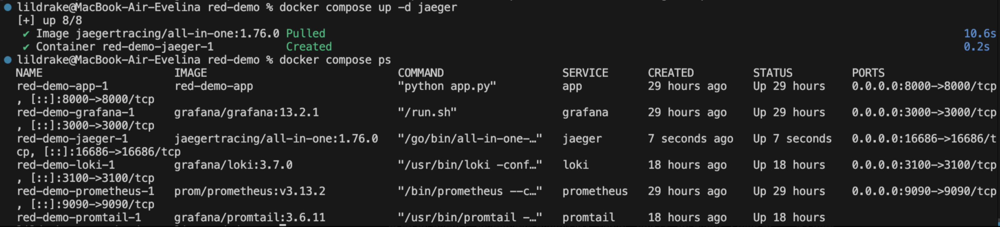

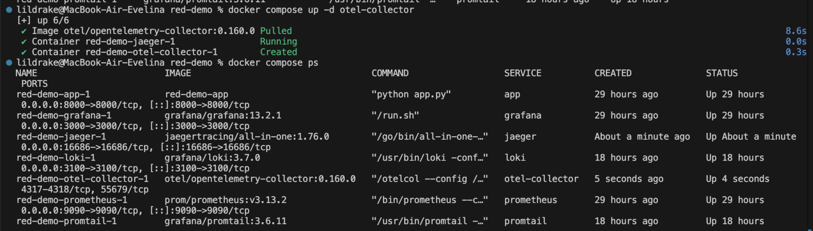

открываю адрес http://127.0.0.1:16686:

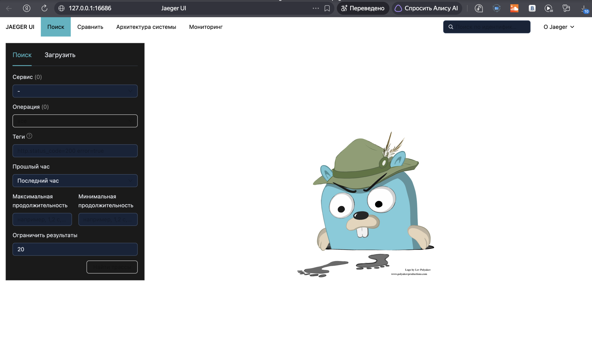

Перехожу в app, отправляю ошибки и в jaeger появляется в Service:

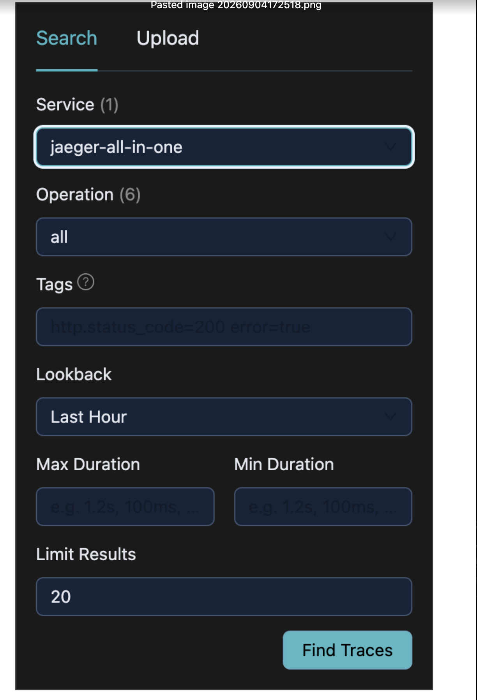

А блин, я смотрю на трейсы и не понимаю, почему там только один спан, закинула в гпт и он мне сказал, что Jaeger показывает собственные запросы... сервис должен быть не самим Jaeger, а сервисом red-demo. Ааа я поняла в чем у меня ошибка, до того, как я дошла до Jaeger, я  закомментировала переменную окружения, которая перенаправляет на Collector, а затем добавила ее, но приложение уже работало без переменной. Поэтому я исправляю и перезапускаю этот контейнер. 

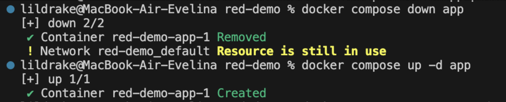

Теперь обратно перехожу к app, создаю задержку, меняю сервис в jaeger и смотрю результат:

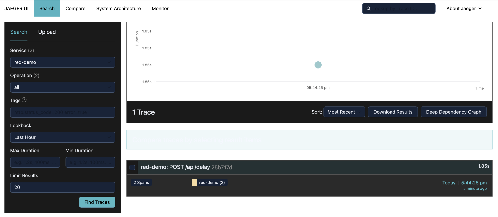

Теперь у меня видно два спана - корневой и вложенный:

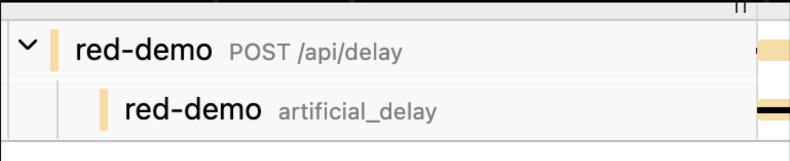

Правда я забыла поменять название спана в app.py, поэтому переименовываю его, пересобираю приложение, отправляю задержку и еще раз смотрю спан:

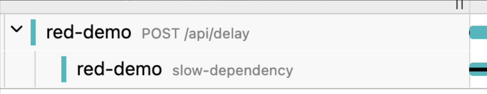
_____________

`Нажми «Создать ошибку» → найди трейс с ошибочным (красным) спаном.`

Создаю ошибку:

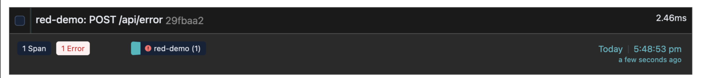

Захожу в логи в Grafana:

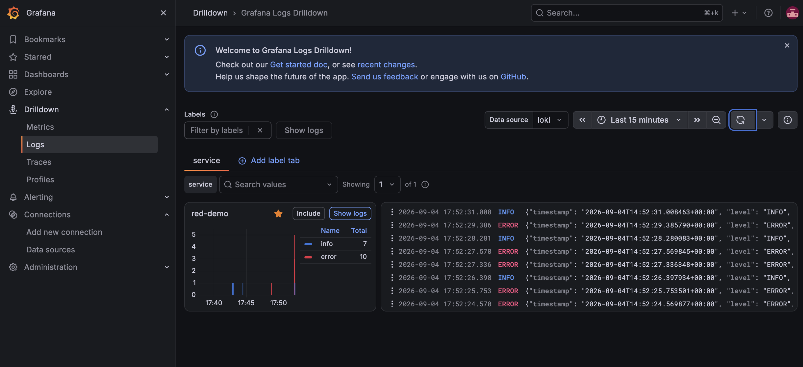

Беру одну ошибку и нажимаю `show context`

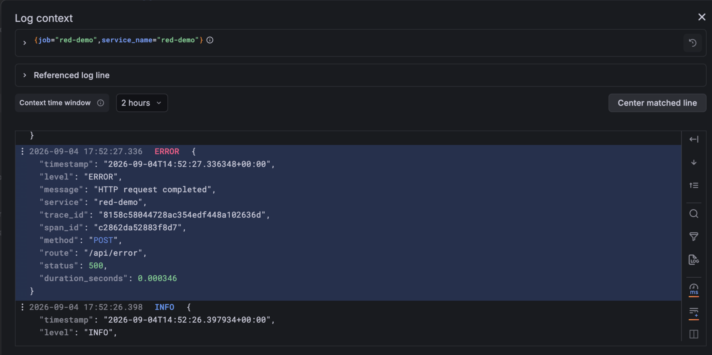

Копирую ее trace_id, вставляю в поиск в jaeger и сервис находит эту ошибку:

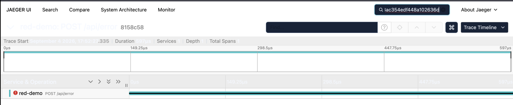

(какой то неудобный интерфейс ес честн)

______

# Часть 5 - Алерты в Alertmanager 

Вопросы, с которыми я столкнулась:
> Что такое алерты? \
> Что такое алертмененджер? \
> Какие есть состояния у алертов? \
> Для чего они нам нужны? <br/>

создаю файл `alert-rules.yml` и в нем прописываю правила, после которых алерты будут отправляться в алертменеджер. Первое правило - если доля ошибок будет больше 20% и ожидание 10 секунд - условие будет истинным, второе правило - если сервис будет получать больше одного запроса в секунду - условие будет истинным, третье правило - если время ответа на запрос превышает одну секунду - условие будет истинны. Если условие истинно, то алерты в Prometheus будут в состоянии firing и он же будет их отправлять в алертменеджер, а алертменеджер будет отправлять webhook.

В конфиг прометеуса добавляю `evaluation_interval`, который будет вычислять правила каждые 5 секунд

```yml
global:
  scrape_interval: 10s
  evaluation_interval: 5s
```

Добавляю в docker compose в сервис `prometheus` строчку для доступа файла `alert-rules.yml` внутри контейнера

```yml
    volumes:
      - ./prometheus.yml:/etc/prometheus/prometheus.yml:ro
      - prometheus_data:/prometheus 
      - ./alert-rules.yml:/etc/prometheus/alert-rules.yml:ro
```

После этого в `promtheus.yml` добавляю код, откуда он будет читать правила

```yml
rule_files:
  - /etc/prometheus/alert-rules.yml
```

Для проверки работоспособности пересоздаю сервис `prometheus`, открываю его, в app создаю ошибки и наблюдаю за алертом в Prometheus

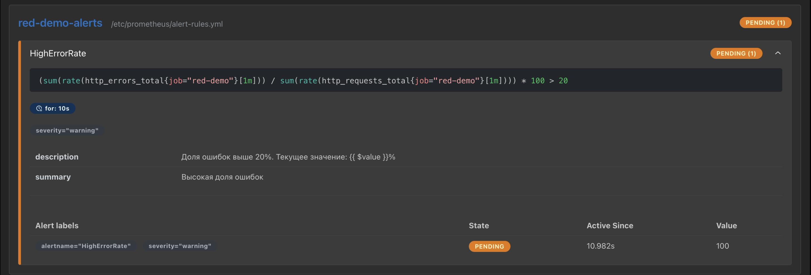

Алерт в состоянии pending. Жду 10 секунд, обновляю страницу

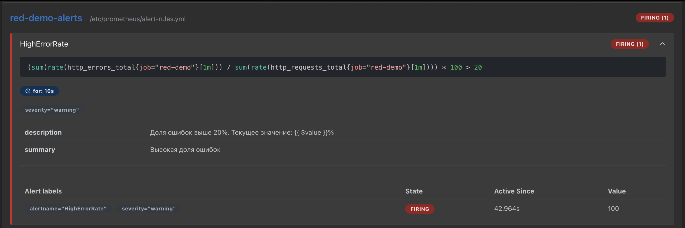

Алерт в состоянии firing.

Создаю файл для сервиса алертменеджер `alertmanager.yml`, в котором я указываю кому отправлять поступившие алерты.

```yml
route:
  receiver: local-webhook
  group_by:
    - alertname
  group_wait: 5s
  group_interval: 10s
  repeat_interval: 1m

receivers:
  - name: local-webhook
    webhook_configs:
      - url: http://webhook:8080/
        send_resolved: true
```

Только я немного запуталась, получается, что в Prometheus мы добавили файл с правилами, в основной конфиг Prometheus мы показали, с какой периодичностью читать этот файл и где его найти. Если условие будет выполняться, в алертменеджер оно будет отправляться. Но у алертменеджера же есть графический интерфейс, зачем ему далее отправлять уведомления алертов на вебхук? посмотреть логи мы сможем только с помощью терминала (которые приходят на вебхук). Наверное я запуталась скорее из-за того, что можно также присылать из алертменеджера уведомления на почту, это будет уже выглядеть логичнее, так как мы так будем больше автоматизировать работу. Я спросила у гпт по поводу этого, он сказал типо да, с вебхуком мы просто просмтариваем уведомления пришедшие от алертменеджера вручную.

В `promtheus.yml` я также добавляю блок, который будет перенаправлять алерты в алертменеджер

```yml
alerting:
  alertmanagers:
    - static_configs:
        - targets:
            - alertmanager:9093
```
В docker compose сервисы выглядят так:

```yml
  webhook:
    image: mendhak/http-https-echo:31

  alertmanager:
    image: prom/alertmanager:v0.33.1
    ports:
      - "9093:9093"
    volumes:
      - ./alertmanager.yml:/etc/alertmanager/alertmanager.yml:ro
      - alertmanager_data:/alertmanager
    depends_on:
      - webhook

volumes:
  prometheus_data:
  grafana_data: 
  loki_data:
  promtail_data:
  alertmanager_data:
```

Запускаю контейнеры:

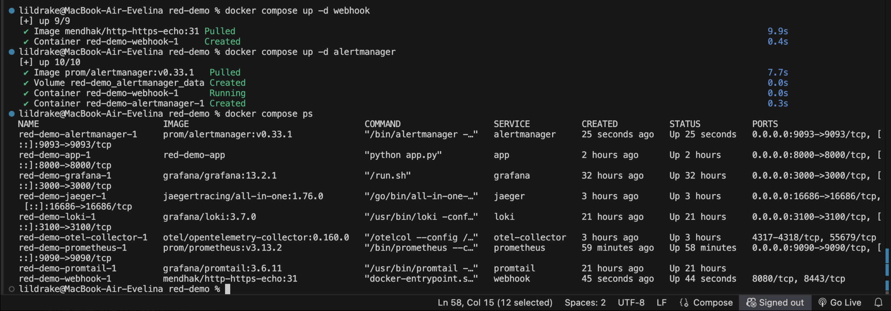

захожу в Prometheus

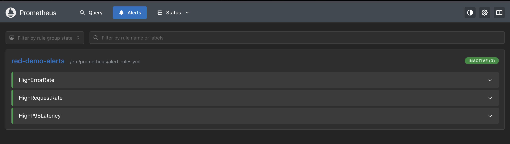

В нем появились алерты в состоянии inactove. Захожу в сервис app, создаю ошибки

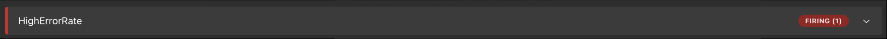
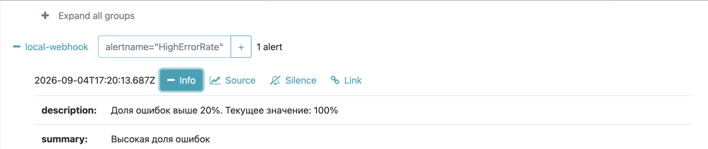

Создаю задержки

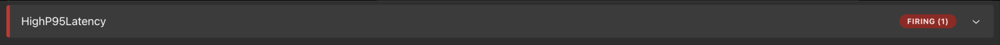
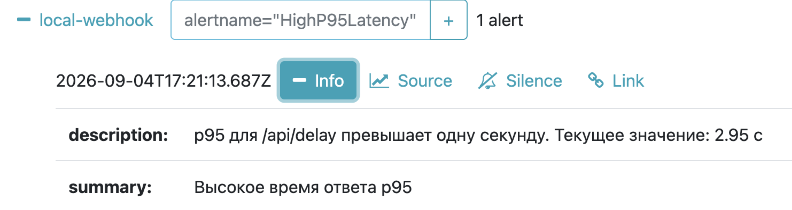

Создаю нагрузку

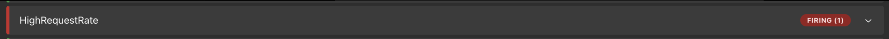
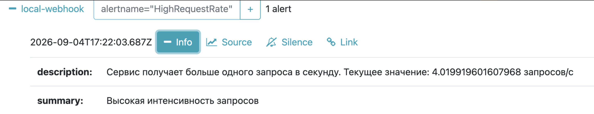

Проверяю логи `webhook` через команду `docker compose logs webhook`

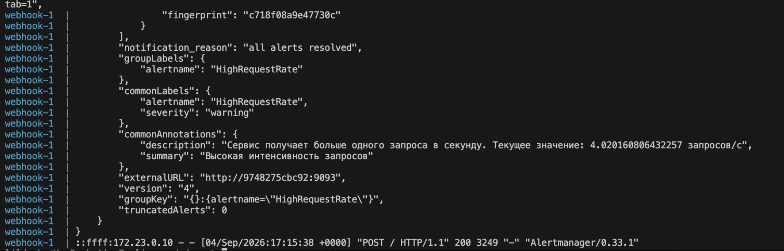

____________
# Вывод

афигеть, это что, конец?


