# Часть 1 - Создание сервиса 
### Что у вас здесь происходит?

________
Я создала сервис с помощью гпт, но так как я не понимаю, что он создал, зачем, как и почему, я решила разобраться в самой базе, инфраструктуре, что и как связано. 

При открытии страницы приложения происходит следующее: браузер отправляет запрос типо дай мне страницу, программа принимает запрос, после этого она возвращает ему описание страницы в HTML и в результате браузер отображает страницу с кнопками. 

В ходе изучении теории я столкнулась со словом “эндпоинт” и с гпт никак не могла понять, что это такое и с чем его едят, поэтому я нашла оч крутую статью про api, в которой и рассказывается про него https://habr.com/ru/articles/964818/?ysclid=mtix7a3svi740460420

Изначально мне было непонятно, как работает приложение внутри, поэтому я разобрала его функции, эндпоинты, как они задаются и вызываются. Затем я перешла к изучению докерфайла, в нем мне все было понятно, кроме строчек 

`ENV PYTHONDONTWRITEBYTECODE=1!` \
`PYTHONUNBUFFERED=1!` \
`USER 10001:10001` <br/>

Я разобрала эти строки и первая отвечает за то, что при импорте модулей кеш не будет записываться и отключается буферизация. Вторая строчка отвечает за пользователя и группу, с какими правами будет работать программа внутри. Я пока что не понимаю смысл этих строчек, поэтому я решила их убрать, оставив такой код:

```yml
FROM python:3.12-slim
WORKDIR /app
COPY requirements.txt .
RUN pip install --no-cache-dir -r requirements.txt
COPY app.py index.html ./
EXPOSE 8000
CMD ["python", "app.py"]
```

Потом я залезла в docker-compose и начала разбирать в нем код. Я понимаю, что в нем происходит, но я не понимаю смысл переменных окружения и хелфчеков (я понимаю что хелфчеки проверяют периодически приложение, но конкретно в этой ситуации зачем он нужен?). Такие переменные окружения он создал: 
` “OTEL_SERVICE_NAME: red-demo” `
, просто указывается использование конкретного имени в логах и трейсах, но в самом файле программы уже используется это имя по умолчанию, поэтому я удалила эту строчку. Еще одна строчка с переменной окружения 
` “OTEL_EXPORTER_OTLP_ENDPOINT: "${OTEL_EXPORTER_OTLP_ENDPOINT:-}"” `
, я прочитала про нее, она нужна для джаегера, а этот джагегер еще и опентелеметри, че за слова…

Короче я начала разбирать что все это значит, и сейчас я понимаю, почему в файле зависимостей написано про библиотеку опентелеметри, именно она будет создавать записи об операциях, а джагегер является хранилищем, которое позволяет эти записи просматривать. Еще мне непонятно, почему прописывается именно такая переменная в докер композ, поэтому я решила почитать код app.py. Я нашла блок кода, который отвечает за отправку трейсов, даже если они не будут объявлены:

```python
provider = TracerProvider(
    resource=Resource.create({"service.name": SERVICE}), sampler=ALWAYS_ON
)
EXPORT_ENABLED = bool(os.getenv("OTEL_EXPORTER_OTLP_TRACES_ENDPOINT") or
                      os.getenv("OTEL_EXPORTER_OTLP_ENDPOINT"))
if EXPORT_ENABLED:
    provider.add_span_processor(BatchSpanProcessor(OTLPSpanExporter()))
trace.set_tracer_provider(provider)
tracer = trace.get_tracer("red-demo")

REQUESTS = Counter("http_requests_total", "Completed HTTP requests",
                   ["method", "route", "status"])
ERRORS = Counter("http_errors_total", "HTTP responses with status 5xx",
                 ["method", "route"])
DURATION = Histogram("http_request_duration_seconds", "Handler duration in seconds",
                     ["method", "route"],
                     buckets=(0.005, 0.01, 0.025, 0.05, 0.1, 0.25, 0.5, 1, 2, 3, 5, 10))
```

Здесь проверяется существование переменной, и затем возвращается булевое значение, если оно равно true, то будет выполняться блок с условием, где используется библиотека опентелеметри, все выполненные операции будут записываться и отправляться по адресу, указанному в переменной. 

Затем у меня появилось еще очень много вопросов, которые я себе выписывала и разбиралась в них, поэтому я решила не захламлять отчет и просто дальше пойти по заданию :)

Итоговый docker-compose для первой части:

```yml
services:
  app:
    build: .
    ports:
      - "8000:8000"
    #environment:
    #  OTEL_EXPORTER_OTLP_ENDPOINT: "http://otel-collector:4318"
```

____________

### Проверка работы сервиса

________

Билжу образ и запускаю контейнер. На время комментирую переменные окружения, так как джаегера еще нет. Ввожу команду `docker compose up -d --build`

Получаю следующий результат:

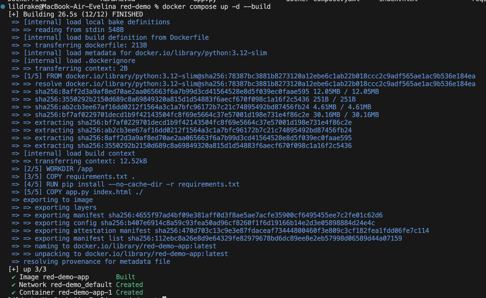

Для проверки работы контейнера использую `docker compose ps` и смотрю результат:

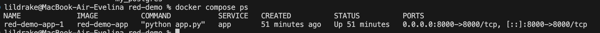

Захожу на адрес http://127.0.0.1:8000 и появляется такая картинка:

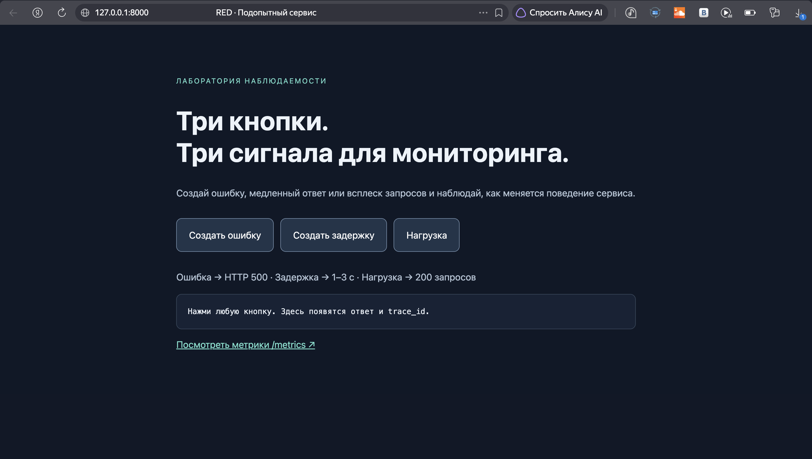

Проверяю работу сервиса, нажимаю на кнопки и в терминале ввожу `docker compose logs -f`:

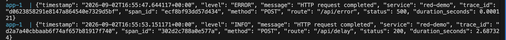

При нажатии на создание ошибки лог выводится сразу, при нажатии на задержку лог выводится с задержкой, что и видно по `"duration_seconds": 2.687324`, при нажатии на нагрузку выводится большое число логов.

Иду исследовать метрики, при нажатии на "Посмотреть метрики" открывается такая картинка:

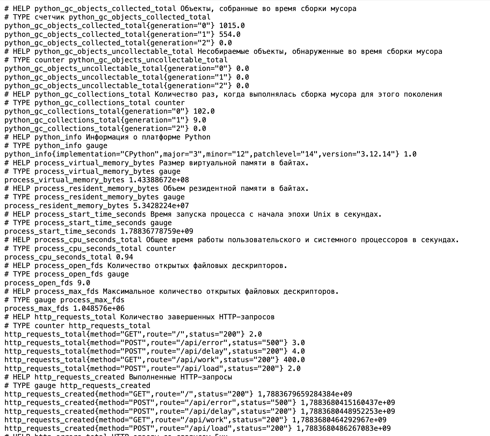

Начинаю проверять их работу. Нажимаю 3 раза на создание ошибки, и вот результат до:

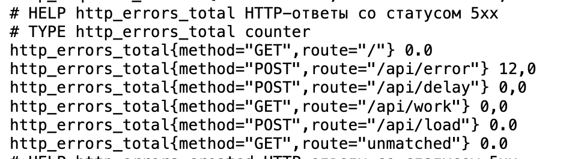

и вот результат после:

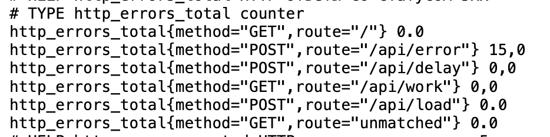

___________

# Часть 2 - Метрики
Ну погнали... 

Вопросы, с которыми я столкнулась:
> Что такое прометеус? \
> Что такое метрики? \
> Что такое графана? \
> Прометеус сам забирает метрики или их отправляет сервис app? \
> Что такое том и как он работает? \
> Почему для графаны мы не создаем файл? \
> Что такое RED? \
> Что такое p95? <br/>

Со всеми вопросами я разобралась и перешла к делу.

Создаю файл `prometheus.yml`, в котором будут написаны настройки сбора метрик, список заданий, эндпоинт и адрес для сбора

```yml
global:
  scrape_interval: 10s
scrape_configs:
  - job_name: red-demo
    metrics_path: /metrics
    static_configs:
      - targets:
          - app:8000
```

так как Prometheus это отдельный сервис, я перехожу в docker-compose для создания контейнера. Беру готовый образ, прописываю порт, так как был написан  `prometheus.yml` локально, с помощью `bind mount` делаю его доступным внутри контейнера. Так как Prometheus сохраняет данные в директории `/prometheus`, создаю именованный том `prometheus_data`, на случай, если контейнер будет пересоздан или удален. В результате получился такой блок в docker-compose:

```yml
 prometheus:
    image: prom/prometheus:v3.13.2
    ports:
      - "9090:9090"
    volumes:
      - ./prometheus.yml:/etc/prometheus/prometheus.yml:ro
      - prometheus_data:/prometheus

volumes:
  prometheus_data:
```

Изначально я хотела создать Dockerfile и вшить в него `prometheus.yml`, но гпт сказал, что это так себе идея, так как если я захочу что-либо поменять в нем, то придется и пересобирать образ и перезапускать контейнер. Поэтому я решила оставить так, как он предложил, просто подключить по пути `/etc/prometheus/prometheus.yml:ro` файл `yml` с правами для чтения, типо `bind mount`. 

Для проверки работы Prometheus я перезапускаю docker-compose командами: `docker compose down`, `docker compose up -d`

> p. s. \
> только потом я узнала, что можно было просто написать `docker compose up -d prometheus` 😐 <br/>

Смотрю результат:

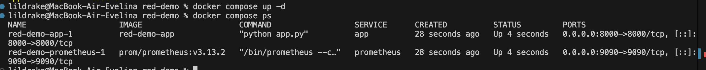

Перехожу по адресу http://127.0.0.1:9090 

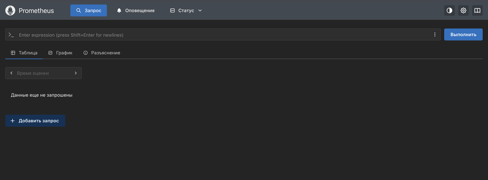

В нем можно даже зайти и посмотреть состояние сервиса на порту 8000, где он будет писать последний сбор данных

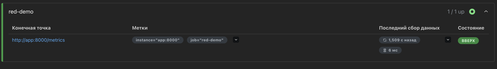

Чтобы проверить его работу, в сервисе app нажимаю `Ошибка`, смотрю название метрики `http_requests_total` и записываю в поиск Prometheus, в итоге он вывел:

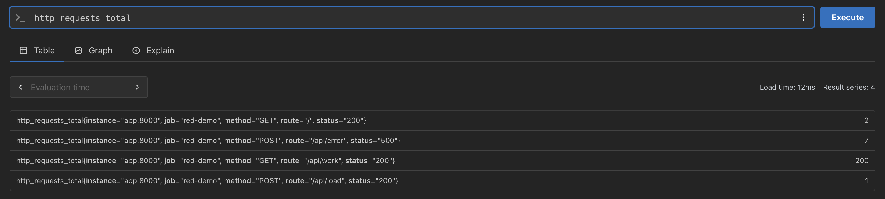

Смотрю график:

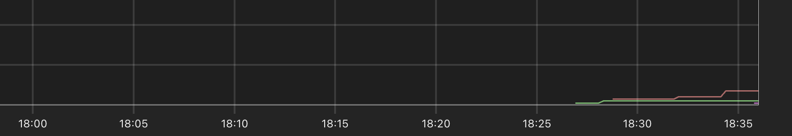

Перехожу к созданию Grafana. В docker-compose добавляю блок:

```yml
  grafana:
    image: grafana/grafana:13.2.1
    ports:
      - "3000:3000"
    volumes:
      - grafana_data:/var/lib/grafana

volumes:
  prometheus_data:
  grafana_data: 
```

Проверяю работу контейнеров:

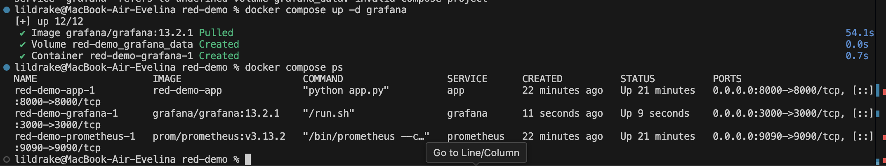

перехожу на http://127.0.0.1:3000/ пишу admin admin и меняю пароль. 

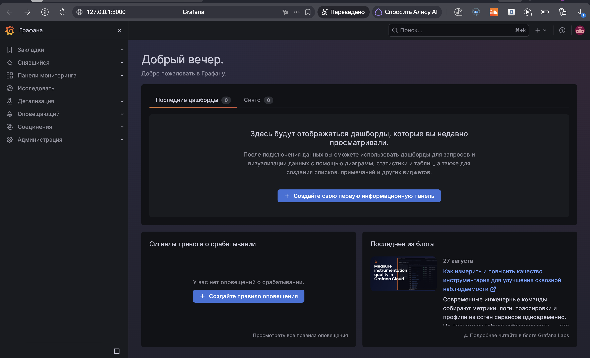

перехожу в соединения, создаю связь, прописываю адрес `http://prometheus:9090` и сохраняю, перехожу в показатели и ТАМ:

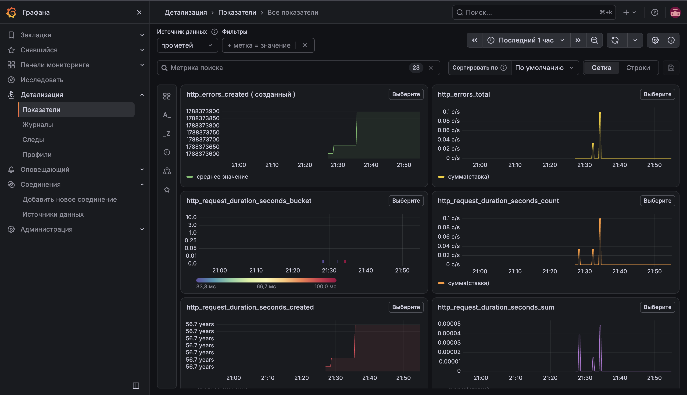

я поражена. прикольно.

Для проверки работы я начала создавать ошибки в сервисе app и перешла к наблюдению за графиками:

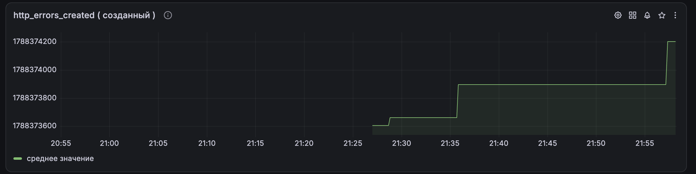

_________

RED – requests, errors, durations

Создаю дашборд и устанавливаю для `requests` значения и операции по счетчику обработанных запросов `http_requests_total`:

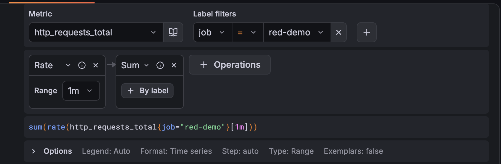

Я понажимала на кнопки в сервисе app, но на графике был плохо заметен результат. Потом я увидела, что можно вместо `last 6 hours` поставить `last 5 minuts`, что я и сделала, потом опять возникла незначительная проблема, я нажимала на нагрузку, и он ничего не выводил даже после `refresh`, только потом до меня дошло, что надо было просто нажать `move`… треш 🫤

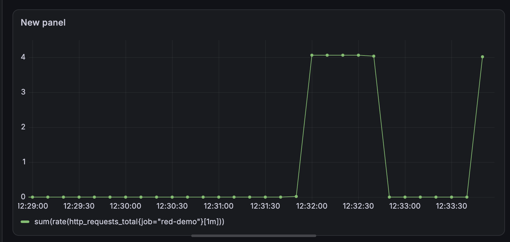

Теперь добавляю на панель долю ошибок. Вставляю код для счетчика ошибок, где ошибочные запросы будут делиться на сумму всех запросов и умножаться на сто

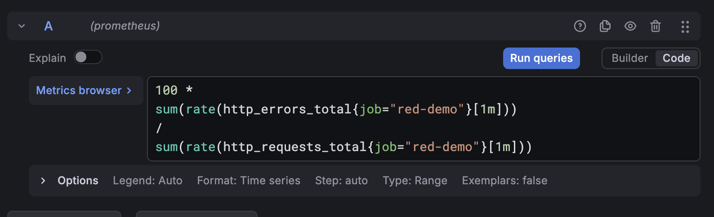

Нажимаю на ошибку, задержку, нагрузку и смотрю результат:

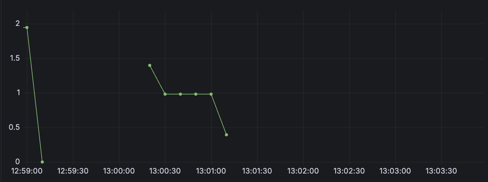

Тут видно что доля ошибок уменьшалась с 1.4 % до 0.4 %

После этого перехожу к durations:

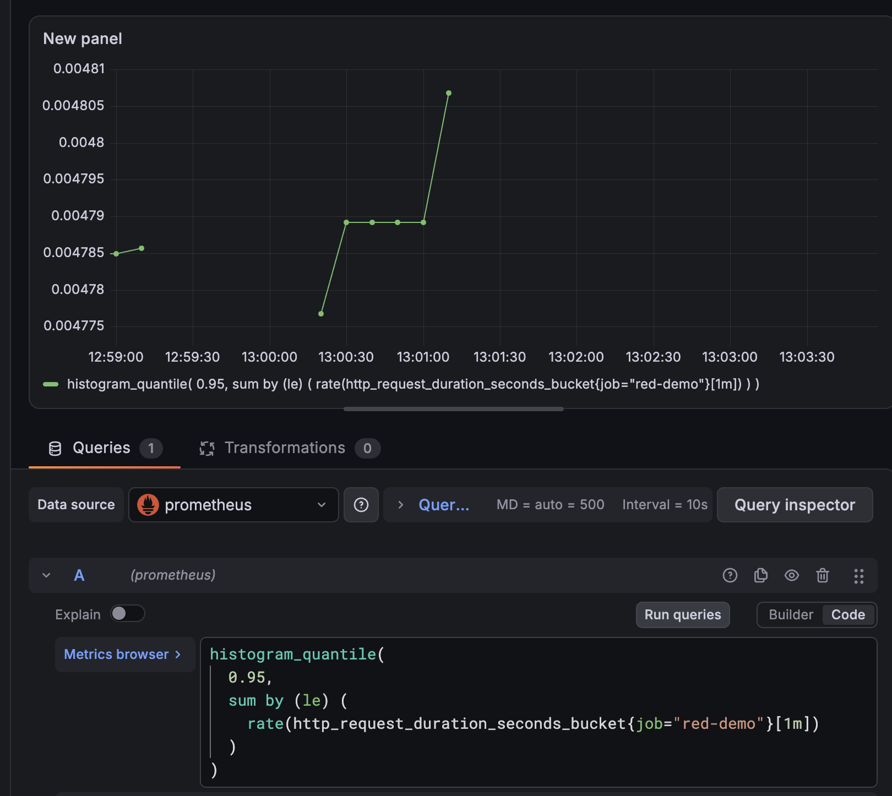

___________

# Часть 3 - Логи

`Подними Loki и агент Promtail` поднять Локи? Стоп... Локи..? 


______

> В этой части будет много мыслей, возражений и поражений

Я прочитала, что Loki хранит логи, а Promtail доставляет записи, но у меня возник вопрос типо `лол, а зачем нам это вообще нужно, если можно просто через терминал посмотреть логи?` Но гпт выдал, что если много сервисов и нужно просматривать каждый, то будет неудобно. Пон. 

Чтобы сразу не получать готовый ответ, я начала думать, если Loki хранит информацию, значит ему нужны `volumes`, если Promtail берет логи из сервиса, значит ему нужно знать, откуда брать и куда отправлять, поэтому ему нужен файл, если Promtail ничего не хранит, значит том ему не понадобится. Ну и соответственно нужно добавить сервисы в `docker-compose`, прописать `image` и `ports`. 

Ага… я прочитала, что Loki нужен конфиг, но можно обойтись и без него, так как он является хранилищем, но он должен понимать, от кого принимать логи. А про Promtail, ему можно добавить том, чтобы при перезапуске он понимал, на каком месте он остановился.

В `docker-compose` я натыкала для Loki `ports`, `image` и `volumes`, практически все одинаково, как и в Prometheus, только `image` я взяла из гпт. Единственное, чем отличался блок Loki от Prometheus это тем, что в нем появилась команда:

```yml
command: ["-config.file=/etc/loki/loki.yml"]
```

 которая указывает, какой файл прочитать при запуске контейнера. Мне стало непонятно, зачем писать эту команду, если у нас есть такая строчка в `volumes`:
 
 ```yml
 “- ./loki.yml:/etc/loki/loki.yml:ro”
```

 которая делает итак файл доступным для чтения внутри контейнера. 

 > Стадия бешенства <br/>

 Тупой чат гпт он мне добавил эту строчку `“command: ["-config.file=/etc/loki/loki.yml"]”` и не смог блин нафиг объяснить что она значит и почему конкретно ее мы добавляем. В итоге я его замучала вопросами `че за бред?` и он выдал типо `сори нам не нужна эта строчка`. Оказывается, что в образе, который я подключила, файл запускается с другим названием, поэтому он мне предложил добавить этот `command`. Пошел нафиг чат гпт, буду теперь сама искать и читать Dockerfile для сервисов. Поэтому я просто меняю строчку 
 ```yml
 ./loki.yml:/etc/loki/loki.yml:ro 
 ```
 на 
 ```yml
 ./loki.yml:/etc/loki/local-config.yaml:ro
```
и удаляю `command`

> Стадия принятия  <br/>

Я перешла к изучению Promtail уже без гпт, я нашла образ 3.6.11, посмотрела его Dockerfile и там также есть файл настройка config.yaml. Над ним скорее мне придется работать и нужно будет его создавать. Также я поглядела разные docker-compose на гитхабе, некоторые в своем коде пишут `command`, и я поняла, что не так страшно его использовать, тем более я уже с ним знакома, поэтому я решила его вернуть 😁

Я начала прописывать блок Promtail в docker-compose, конфиг `promtail.yaml` мне сделал гпт. Для того, чтобы проверить, правильно ли я написала блок в docker-compose, я его закинула в гпт, и тут я испугалась, потому что он мне написал еще такую строчку в 'volumes':

```yml
- /var/run/docker.sock:/var/run/docker.sock:ro
```

Но, как оказалось, все логично. Так как Promtail должен собирать и доставлять логи в Loki, ему необходимо знать, какие контейнеры запущены и откуда получать их записи. Для этого сокет Docker `docker.sock` делается доступным внутри контейнера Promtail. Через него Promtail обращается к Docker Engine, обнаруживает контейнеры и получает их логи.

В итоге блоки для Loki и Promtail получились такими:

```yml
  loki:
    image: grafana/loki:3.7.0
    command: ["-config.file=/etc/loki/loki.yml"]
    ports:
      - "3100:3100"
    volumes:
      - ./loki.yml:/etc/loki/loki.yml:ro
      - loki_data:/loki

  promtail:
    image: grafana/promtail:3.6.11
    command: -config.file=/etc/promtail/promtail.yaml
    volumes:
      - ./promtail.yaml:/etc/promtail/promtail.yaml:ro
      - promtail_data:/var/lib/promtail
      - /var/run/docker.sock:/var/run/docker.sock:ro

volumes:
  prometheus_data:
  grafana_data: 
  loki_data:
  promtail_data:
```

 _____________
 ### Запуск и проверка работы
 _________
> Пока что я сталкивалась только с ошибками по невнимательности, например вместо `yaml` я могла написать `yml`, и ошибки
> связанные с неправильно написанным `command` <br/>

Запускаю Promtail и Loki с помощью команды `docker compose up -d loki promtail`

> К сожалению, я забыла заскринить момент запуска, поэтому тут будет чилловый парень <br/>


