# Часть 1 - Создание двух сервисов

Создаю два сервиса с помощью гпт - `user-service`, который будет являться `producer` и `picker-service`, который будет являться `consumer`. Оба сервиса написаны на языке python и имеют похожие Dockerfile, отличие только в портах.

Dockerfile для `user-service`:
```yml
FROM python:3.12-slim
WORKDIR /app
COPY requirements.txt .
RUN pip install --no-cache-dir -r requirements.txt
COPY app.py .
EXPOSE 8000
CMD ["python", "app.py"]
```

Dockerfile для `picker-service`:
```yml
FROM python:3.12-slim
WORKDIR /app
COPY requirements.txt .
RUN pip install --no-cache-dir -r requirements.txt
COPY app.py .
EXPOSE 8001
CMD ["python", "app.py"]
```
_________
### Обзор сервиса user-service
__________
1. Запуск HTTP-сервера:

```python
if __name__ == "__main__":
    app.run(host="0.0.0.0", port=8000)
```
2. Кнопка "Создать заказ"

```python
  <form method="post" action="{{ url_for('create_order') }}">
    <button type="submit">Создать заказ</button>
  </form>
```

3. Создание события "заказ создан"

```python
@app.post("/orders")
def create_order():
    order = {
        "order_id": str(uuid.uuid4())[:8],
        "items": ["кофе", "молоко"],
        "created_at": datetime.now(timezone.utc).isoformat(),
    }
```

4. Публикация события в Kafka

```python
producer.produce( 
    topic=KAFKA_TOPIC,
    key=order["order_id"].encode("utf-8"),
    value=json.dumps(order, ensure_ascii=False).encode("utf-8"),
    callback=delivery_callback,
)
```

5. Получение партиции и оффсет от Kafka

```python
def delivery_callback(error, message):
    delivery_result["error"] = error
    if error is None:
        delivery_result["partition"] = message.partition()
        delivery_result["offset"] = message.offset()
    delivery_finished.set()
```

6. Показ отправленного заказа, партиции и оффсет

```python
<tr><th>Order ID</th><th>Товары</th><th>Партиция</th><th>Offset</th></tr>

<td>{{ order.order_id }}</td>
<td>{{ order.items | join(', ') }}</td>
<td>{{ order.partition }}</td>
<td>{{ order.offset }}</td>
```
________
### Обзор сервиса picker-service
___________

1. Чтение топика группой consumers

```python
def consume_orders(): # создание consumer
    consumer = Consumer(
        {
            "bootstrap.servers": KAFKA_BOOTSTRAP_SERVERS,
            "group.id": KAFKA_GROUP_ID,
            "auto.offset.reset": "earliest",
            "enable.auto.commit": False,
        }
    ) 
```

2. На каждое сообщение собирает заказ

```python
message = consumer.poll(1.0)

if message is not None and not message.error():
    # получение заказ из Kafka
    order = json.loads(message.value().decode("utf-8"))

    # показываем, что заказ сейчас обрабатывается
    consumer_status["state"] = f"processing {order['order_id']}"

    # имитируем сборку заказа
    time.sleep(PROCESSING_SECONDS)

    # сохраняем данные обработанного сообщения
    order["partition"] = message.partition()
    order["offset"] = message.offset()
    order["instance_name"] = INSTANCE_NAME

    # добавляем заказ в список для показа на странице
    processed_orders.append(order)

    # подтверждаем Kafka успешную обработку
    consumer.commit(message=message, asynchronous=False)
```
________
# Часть 2 - Поднятие Kafka и запуск сервисов

Создаю контейнеры в docker-compose для сервисов `user-service` и `picker-service`

```yml
services:
  user-service:
    build: ./user-service
    ports:
      - "8000:8000"
    environment:
      INSTANCE_NAME: user-service-1
      KAFKA_BOOTSTRAP_SERVERS: kafka:9092
      KAFKA_TOPIC: orders
```

```yml
  picker-service:
    build: ./picker-service
    ports:
      - "8001:8001"
    environment:
      KAFKA_BOOTSTRAP_SERVERS: kafka:9092
      KAFKA_TOPIC: orders
      KAFKA_GROUP_ID: pickers
      INSTANCE_NAME: picker-1
      PROCESSING_SECONDS: "2"
```

Указываю путь, где необходимо сбилдить образ, публикую порты и переписываю переменные окружения. 

Перехожу к созданию контейнера для kafka. Беру готовый образ, переменные окружения я взяла из официального сайта, а затем с помощью гпт я их дополнила. Я использовала комментирование дял конкретных строчек, чтобы разобраться, что они означают.

```yml
  kafka:
    image: apache/kafka:4.3.1
    hostname: kafka 
    environment:
      KAFKA_NODE_ID: 1 # уникальный id узла
      KAFKA_CONTROLLER_QUORUM_VOTERS: 1@kafka:9093 # число 1 - node_1, контроллер с таким айди доступен по адресу kafka:9093 
      KAFKA_PROCESS_ROLES: broker,controller # роли кафки
      
      KAFKA_LISTENERS: PLAINTEXT://:9092,CONTROLLER://:9093 # принимать подключения от других контейнеров типа 0.0.0.0
      KAFKA_ADVERTISED_LISTENERS: PLAINTEXT://kafka:9092 # адрес, который сообщает кафка продюсеру и консюмер
      KAFKA_CONTROLLER_LISTENER_NAMES: CONTROLLER
      KAFKA_INTER_BROKER_LISTENER_NAME: PLAINTEXT
      KAFKA_LISTENER_SECURITY_PROTOCOL_MAP: CONTROLLER:PLAINTEXT,PLAINTEXT:PLAINTEXT

      KAFKA_OFFSETS_TOPIC_REPLICATION_FACTOR: 1
      KAFKA_TRANSACTION_STATE_LOG_REPLICATION_FACTOR: 1
      KAFKA_TRANSACTION_STATE_LOG_MIN_ISR: 1
      KAFKA_GROUP_INITIAL_REBALANCE_DELAY_MS: 0
      KAFKA_AUTO_CREATE_TOPICS_ENABLE: "false" # отключение автоматического осздания топика
```

Затем я перешла к созданию декларативного топика `orders`. Изначально я не понимала, зачем его создавать отдельно, если kafka итак умеет автоматически создавать топики. Но kafka использует настройки broker по умолчанию, поэтому невозможно будет проконтролировать параметры конкретного топика. При декларативном создании можно явно указать его название, количество партиций, `replication factor` и `retantion`, что делает использование намного удобнее. 

Я создала директорию `topic-manager`, в которой находятся файлы app.py, requirements.txt и Dockerfile.

В файле app.py сначала считываются переменные окружения, а затем создаётся административный Kafka-клиент AdminClient, который позволяет управлять топиками через Kafka Admin API. Затем создаются две функции, первая - `wait_for_kafka()`, которая будет периодически проверять доступность `broker`, а вторая - `create_topic()` будет проверять, существует ли топик `orders`, и применять условия: если существует - повторно не создается, если не существует - программа создаёт его с одной партицией, одной репликой и сроком хранения сообщений семь дней.

> (Информация для себя, чтобы перечитывать) \
> Значит producer создает событие, это событие передается внутреннему kafka-клиент producer, этот 
> kafka-клиент producer запрашивает метаданые у kafka broker, типо какие топики существуют, сколько партиций в `orders` и какой 
> `broker` является `leader` для каждой партиции? после этого kafka-клиент producer готовит ему сообщение и указывает
> `order-id` в качестве ключа, чтобы связанные события переходили в одну партицию. Kafka broker принимает это сообщение, 
> закидывает в ту партицию,
> которую ему определил kafka-клиент producer, и сам уже выбирает какой `offset` поставить событию. После этого
> отправляет сообщение обратно `ACK`, что все получилось. У Consumer в app.py 
> задано, чтобы он постоянно проверял kafka по назначенной ему партиции, он запрашивает сообщение и ждет его максиум 1 
> секунду, сли сообщения нет, он возвращает `none` и снова запускает `poll`. А если он получил сообщение, то
> выводит его данные и выполняет `commit`.

Перехожу в docker-compose, где создаю контейнер `topic-manager`

```yml
  topic-manager:
    build: ./topic-manager
    environment:
      KAFKA_BOOTSTRAP_SERVERS: kafka:9092
      TOPIC_NAME: orders
      TOPIC_PARTITIONS: "1"
      TOPIC_REPLICATION_FACTOR: "1"
      TOPIC_RETENTION_MS: "604800000"
    depends_on:
      kafka:
        condition: service_started
    restart: "no"
```

В нем описано, на какой адрес он должен пойти, название топика, количество партиций, количество реплик и миллисекунды жизни события (7 суток). Сервис `topic-manager` запускается после запуска Kafka и создаёт в ней топик `orders` с указанными настройками. Поэтому в сервис `kafka` была добавлена переменная окружения:

```yml
KAFKA_AUTO_CREATE_TOPICS_ENABLE: "false"
```
Чтобы Kafka самостоятельно не создала этот топик с настройками по умолчанию.

Также в сервисы `user-service` и `picker-service` была добавлена зависимость:

```yml
    depends_on:
      topic-manager:
        condition: service_completed_successfully
```

Которая указывает Docker Compose не запускать приложения, пока контейнер topic-manager не завершит работу успешно, то есть пока не создастся топик `orders`

____________
### Запуск и проверка работы
_________

Запускаю контейнеры и билжу образы с помощью команды `docker compose up -d --build` и получаю такой результат:

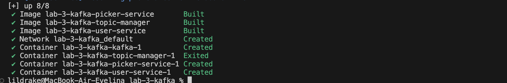

Проверяю работу контейнеров с помощью команды `docker ps`:

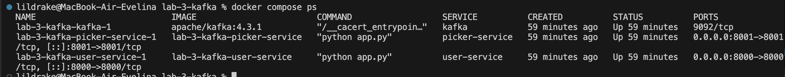

Перехожу по адресу http://127.0.0.1:8000:

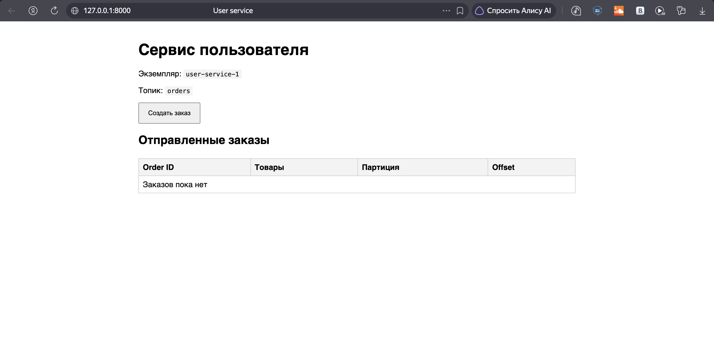

Перехожу по адресу http://127.0.0.1:8001:

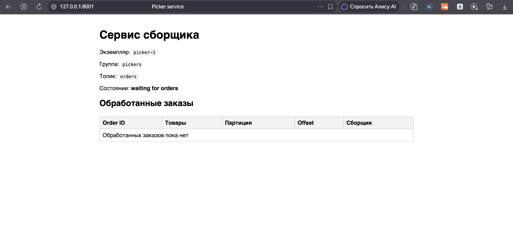

В сервисе `user-service` нажимаю на кнопку `Создать заказ`, и открывается такая картинка... блин

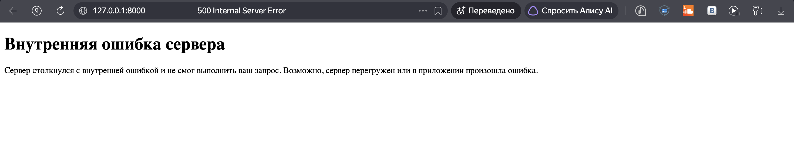

Заглядываю в логи этого сервиса через терминал по команде `docker compose logs user-service`. Вообще Kafka вроде работает, потому что в логах есть сообщение `192.168.65.1 - - [08/Sep/2026 20:08:26] "GET / HTTP/1.1" 500 -`, а остальные ошибки это что-то связано с app.py, поэтому я их закинула гпт. Он мне показал, что ошибка находися в app.py на строчке

```python
<td>{{ order.items | join(', ') }}</td>
```

и мне нужно ее заменить на такую:

```python
<td>{{ order["items"] | join(", ") }}</td>
```

Пересобираю контейнер `user-service` командой `docker compose up -d --build user-service`:

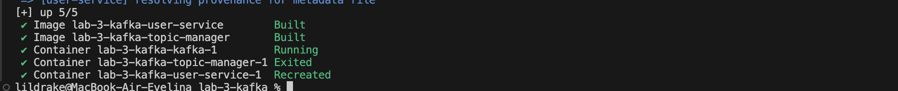

Перехожу по адресу и нажимаю кнопку `Создать заказ`:

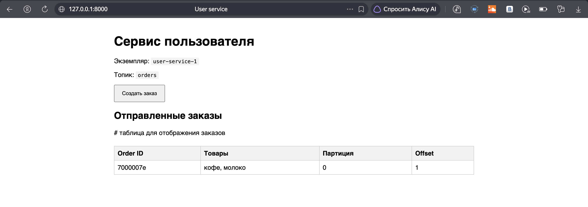

Теперь он отображает отправленные заказы, поэтому я перехожу на адрес `http://127.0.0.1:8001/` сервис `picker-service`, и тут опять ошибка 😭

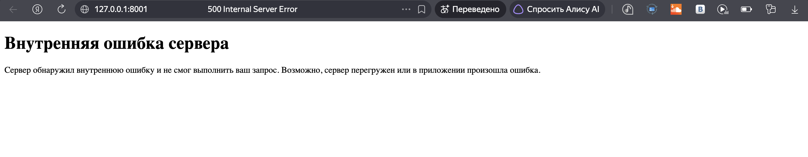

Смотрю логи `picker-service`, используя команду `docker compose logs picker-service`. Я подозреваю, что там может быть такая же ошибка, что и в `user-service`, поэтому сразу в `app.py` меняю ту самую строчку на `<td>{{ order["items"] | join(", ") }}</td>`. Пересобираю контейнер командой `docker compose up -d --build picker-service` и опять проверяю работоспособность. 

Нажимаю кнопку "Создать заказ":

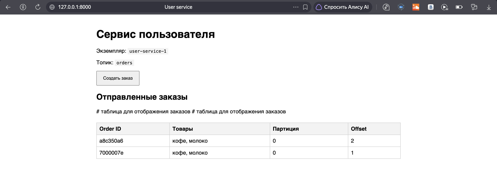

Перехожу по адресу `http://127.0.0.1:8001/`:

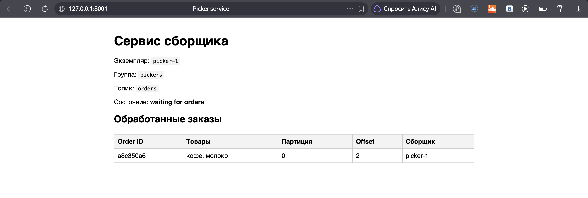

Ееее заработало 

Смотрю логи `topic-manager` по команде `docker compose logs topic-manager`:

```yml
topic-manager-1  | Kafka is ready
topic-manager-1  | Topic orders already exists
```
Смотрю логи сервиса `kafka`:

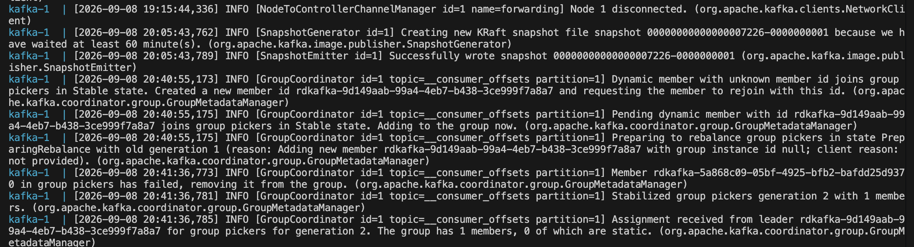

________
# Часть 3 - Бизнес-ситуации

### Бизнес ситуация №1
_________
После прочтения первое, что мне пришло в голову - создать больше партиций, так как именно они отвечают за параллельную обработку сообщений. А это значит, что для сервиса `topic-manager` нужно изменить значение на `TOPIC_PARTITIONS: "5"` . Пересоздаю контейнер:

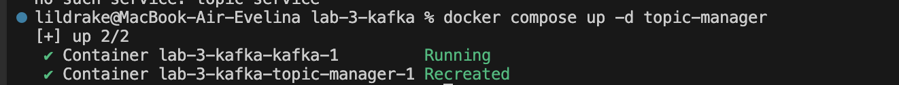

Затем я открыла страницу user-service, создала несколько заказов, но заметила, что все они по-прежнему попадали только в партицию 0.

Причина оказалась в логике файла topic-manager/app.py. Если топик orders уже существовал, программа выводила сообщение Topic orders already exists и завершала работу:

```python
if TOPIC_NAME in metadata.topics: print(f"Topic {TOPIC_NAME} already exists") return
```

Таким образом, изменение переменной окружения TOPIC_PARTITIONS не влияло на уже существующий топик.

После выполнения команд `docker compose down` и `docker compose up -d` Kafka запустилась заново, а `topic-manager` создал новый топик `orders` уже с пятью партициями. После этого на странице `user-service` стали отображаться заказы, распределённые между партициями 0–4:

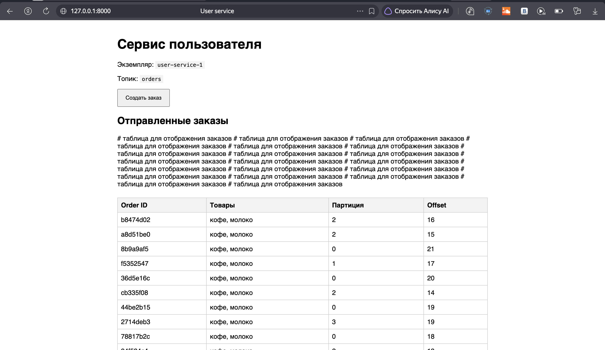

> правда мне кажется не совсем правильным брать так и пересоздавать полностью контейнеры, так как если рассматривать 
> реальную работу, то можно перезапуском потерять данные, а у меня даже локального тома нет для их хранения

Я подумала, что на этом все закончилось - увеличилось число партиций - появилось параллельное выполнение действий. Но я совсем забыла, что у меня только один `consumer`. Поэтому я перехожу в docker-compose и добавляю еще 4 `picker-service`. На каждую партицию = один consumer. Изменяю строчки:

```yml
ports:
- "8005:8001"

INSTANCE_NAME: picker-5
```

После изменения конфигурации запускаю контейнеры `docker compose up -d --build`:

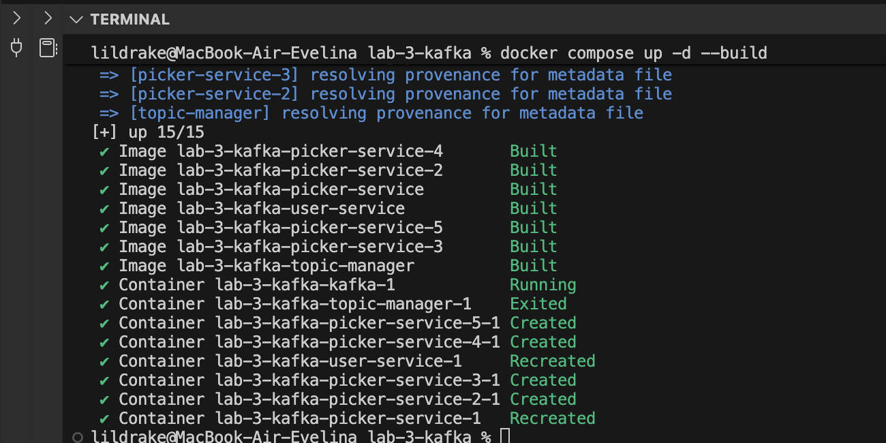

Проверяю состояние контейнеров:

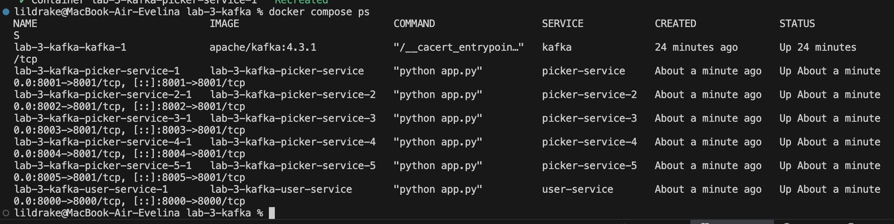

Для проверки рапсределения заказов перехожу на http://127.0.0.1:8000, создаю много заказов, открываю сервисы `consumers` и смотрю на результат (выполнение приведено на двух `consumer`):

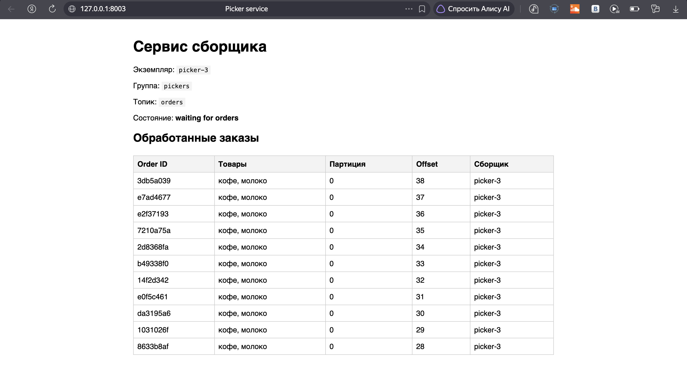

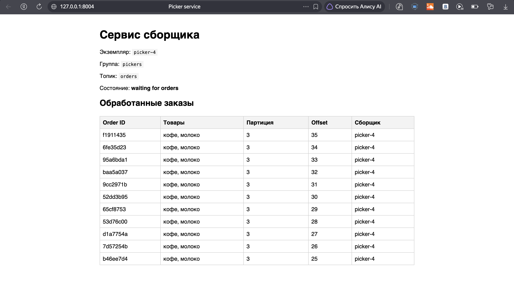
_________________
### Исправление ситуации с `docker compose down` и `docker compose up -d`
_________
Так как подход с перезапуском всех сервисов может навредить, я решила спросить у гпт как избежать ситуации с потерей данных. Он мне написал, что в `topic-manager/app.py` нужно добавить сравнение с желаемым колиеством партиций.

Сначала в программу добавляется NewPartitions:

```python
from confluent_kafka.admin import (
    AdminClient,
    NewPartitions,
    NewTopic,
)
```

`NewTopic` создаёт новый топик, а `NewPartitions` нужен, чтобы добавить партиции в топик, который уже существует.

Программа узнаёт, сколько партиций сейчас находится в топике:

```python
current_partitions = len(
    metadata.topics[TOPIC_NAME].partitions
)
```

Kafka возвращает метаданные топика `orders`, а функция `len()` считает количество найденных партиций.

Затем программа сравнивает текущее количество партиций с числом из переменной окружения:

```python
if TOPIC_PARTITIONS > current_partitions:
```

Например, если сейчас существует одна партиция, а в `docker-compose.yml` указано пять, условие выполняется и программа переходит к увеличению их количества.

Создаётся запрос на изменение топика:

```python
new_partitions = NewPartitions(
    TOPIC_NAME,
    TOPIC_PARTITIONS,
)
```

В запрос передаются название топика и новое итоговое количество партиций. Значение 5 означает, что всего должно стать пять партиций, а не то, что нужно добавить ещё пять.

Запрос отправляется в Kafka:

```python
result = admin.create_partitions([new_partitions])
```

`AdminClient` обращается к Kafka и просит увеличить количество партиций существующего топика.

Программа ожидает ответ Kafka:

```python
result[TOPIC_NAME].result(timeout=30)
```

Она ждёт завершения операции не больше 30 секунд. Если партиции добавлены успешно, выполнение продолжится. Если Kafka вернёт ошибку, программа её покажет.

В конце вызывается новая функция:

```python
create_or_update_topic()
```

Она не только создаёт отсутствующий топик, как было раньше, но и проверяет количество партиций уже существующего топика и при необходимости увеличивает его.

Теперь логика `topic-manager/app.py` выглядит так:
- если топика нет — он создаётся;
- если топик существует и нужно больше партиций — они добавляются;
- если указано столько же или меньше — программа ничего не меняет и завершает работу.

Также добавляю том для `kafka` в `docker-compose`. Я спросила у гпт, как это сделать, и он мне показал такой способ - сначала создаю переменную окружения, которая будет добавлять всю информацию по пути в файл `/var/lib/kafka/data`, а затем подключаю постоянный локаьлный том в `volumes`:

```yml
environment:
  KAFKA_LOG_DIRS: /var/lib/kafka/data

volumes:
  - kafka_data:/var/lib/kafka/data
```

> Почему для добавления тома нам понадобилось явно указывать куда kafka должен сохранять данные? Если, например, в 
> prometheus мы этого не делали? Также я узнала, что кафка записывает свои данные в `/tmp/kraft-combined-logs`, зачем нам 
> создавать переменную, если можно просто добавить том и подключить к этому файлу? Гпт говорит, что правильно указывать
> и так и так, использование `kafka_data:/var/lib/kafka/data` надежнее, а использование `/tmp/kraft-combined-logs` - "Если Kafka уже настроена записывать данные именно туда, всё будет сохраняться. Но тогда мы полагаемся на настройки по умолчанию конкретного Docker-образа. Чтобы конфигурация была понятной и не зависела от значения по умолчанию, мы явно записываем оба параметра". Но если честно, я так и не совсем поняла, зачем нам конкретно создавать `kafka_data:/var/lib/kafka/data`, если итак есть `/tmp/kraft-combined-logs`. 

> Ладно, теперь я поняла, что и так и так правильно, и можно не доабвлять переменную окружения и просто написать `kafka_data:/tmp/kraft-combined-logs`, но решила уже оставить `kafka_data:/var/lib/kafka/data`


Перезапускаю сервис, меняю число партиций на `6` и проверяю работу на адресе `http://127.0.0.1:8000`:

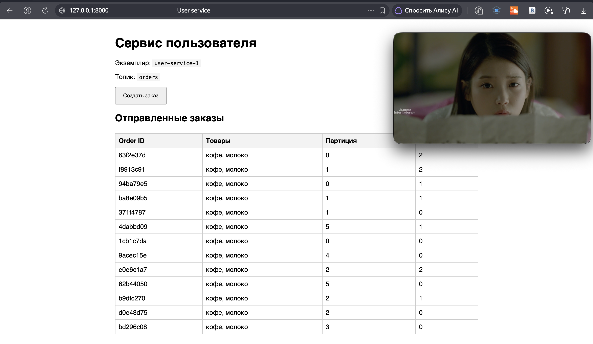

Теперь видно, что все работает, так как появилась 5 партиция. 

Уменьшаю количество партиций до 1, перезапускаю сервис `topic-manager` и смотрю результат. Партиции не уменьшились. Это связано с тем, что для этого kafka пришлось бы решить, куда перенести существующие сообщения, объединить несколько независимых последовательностей offsets, определить новый порядок событий, изменить сохранённые offsets consumer groups, перераспределить события, записанные по ключам, поэтому kafka не поддерживает уменьшение количества партиций существующего топика.

Для того, чтобы уменьшить число партиций, можно будет создать новый топик, обозначить 1 партицию и переключить на этот топик `producer` и `consumer`.

Возвращаю конфигурацию к прежней, удаляю 4 сборщиков и контейнеры:

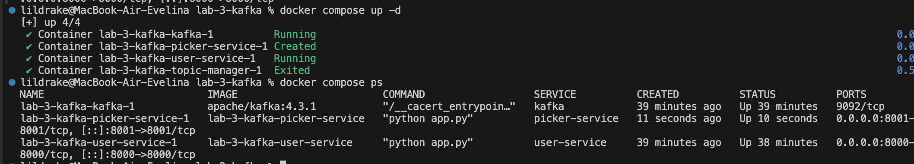

_________________
### Бизнес ситуация №2
_________________

Создаю второй сборщик `picker-service-2`, меняю в нем порты и имя сборщика на:

```yml
ports:
  - "8002:8001"
INSTANCE_NAME: picker-2
```

Запускаю контейнер `picker-service-2` командой `docker compose up -d picker-service-2`:

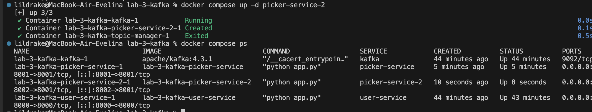

Перехожу на сервис `producer`, создаю заказы и наблюдаю за результатом на сервисах сборщиков.

Создание заказов:

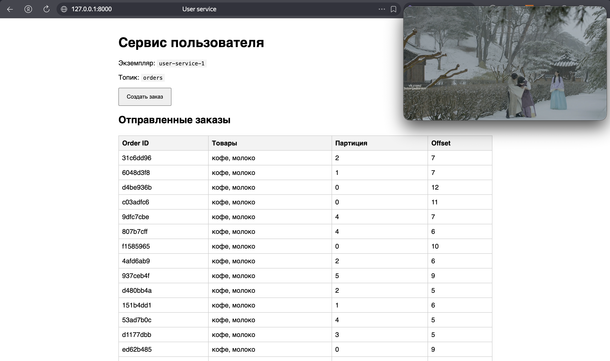

Проверка результата на `picker-service`:

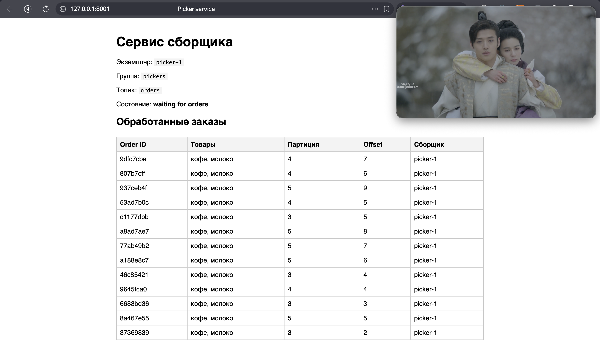

Проверка результата на `picker-service-2`:

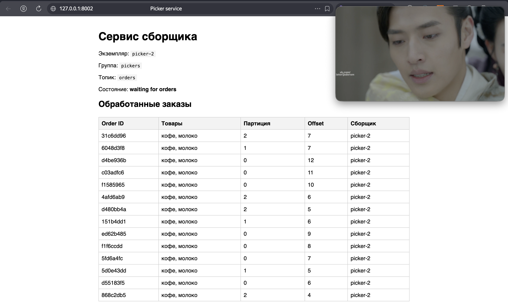

Заказ `31c6dd96` обработал сборщик `picker-service-2`, заказ `9dfc7cbe` обработал сборщик `picker-service`. 

Проверяю, что произойдет, если сборщиков станет больше, чем партиций для них. Так как в прошлый раз я создала 5 партиций, мне очень не хочется делать проверку на 6 сборщикaх.

> Даже Ван Ук не выдержал и заплакал
> 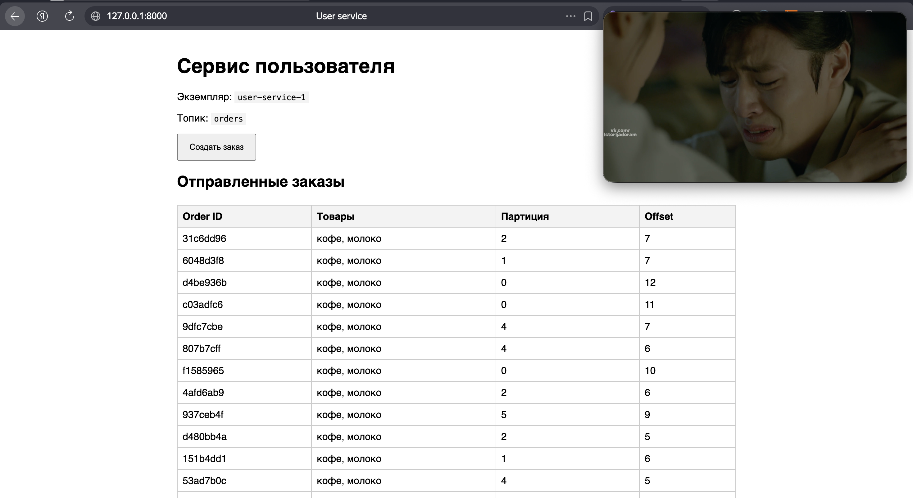

Поэтому я удалю контейнеры и том, значения для партиций выставляю 2, создаю еще одного сборщица `picker-service-3` и запускаю контейнеры:

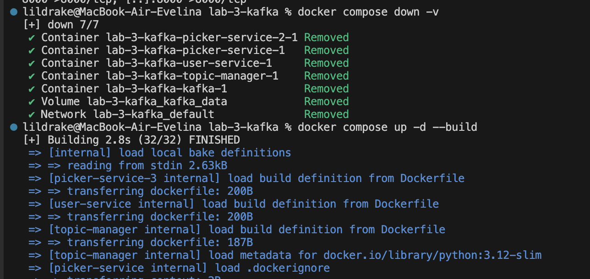

Проверяю работу через `docker compose ps`:

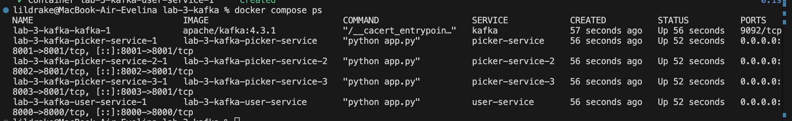

Перехожу на `http://127.0.0.1:8000/` и создаю заказы, перехожу на `http://127.0.0.1:8001/`, `http://127.0.0.1:8002/`, `http://127.0.0.1:8003/` и смотрю на результат.

Создание заказов:

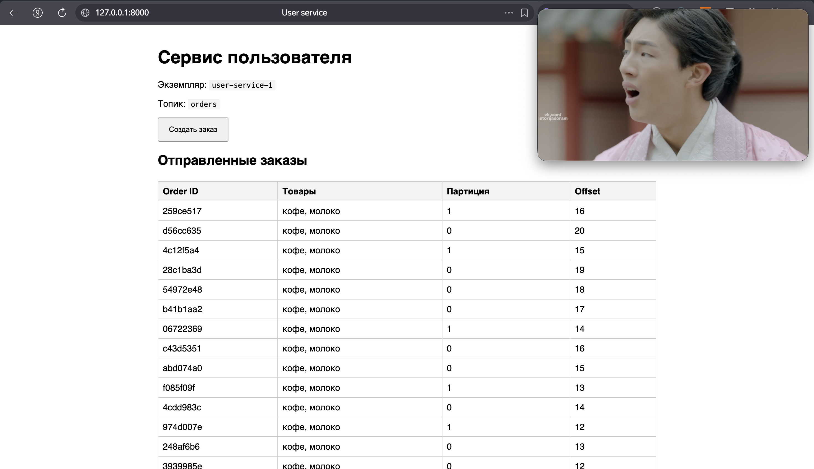

Сборщик `picker-1`:

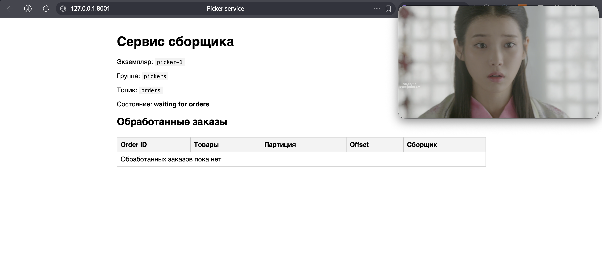

Сборщик `picker-2`:

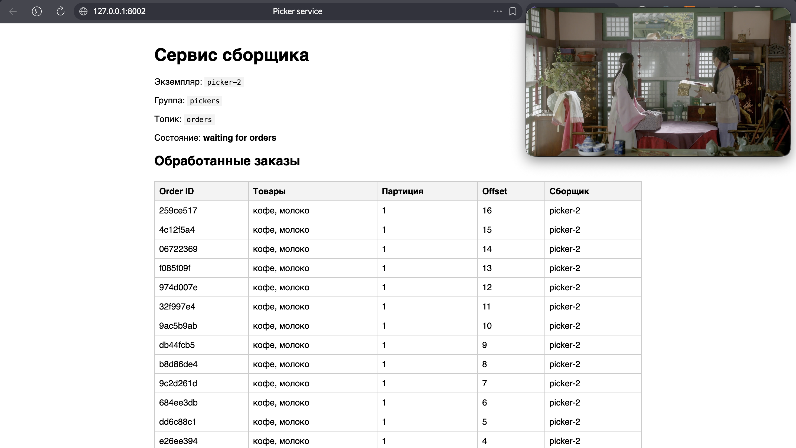

Сборщик `picker-3`:

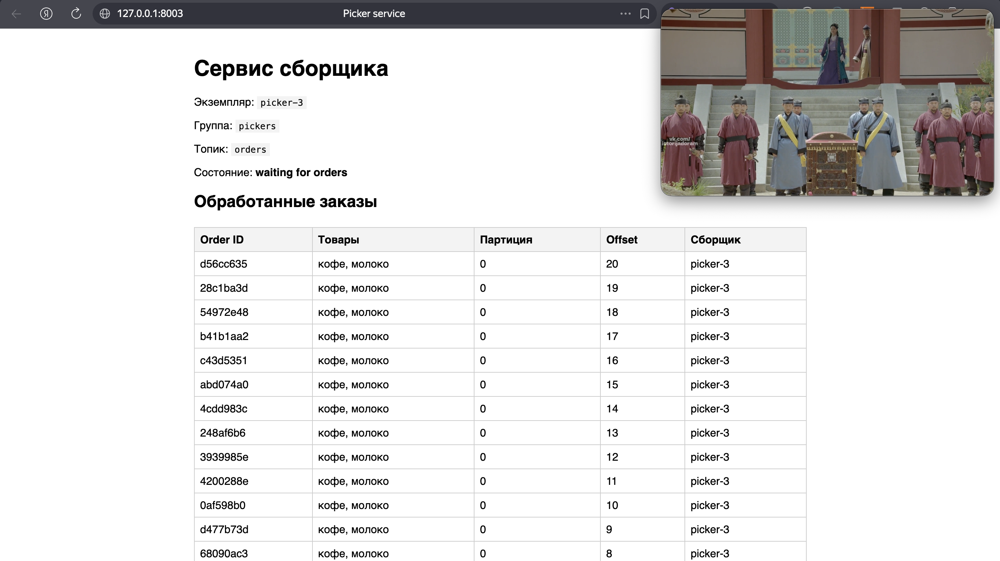

Внутри `consumer group` одна партиция назначается только одному сборщику, поэтому увеличение сборщиков никак не повлияет на увеличение количества обработки сообщений. 

_________________
### Бизнес ситуация №3
_________________

Даже если все сборщики перестанут работать, сообщения продолжат храниться в Kafka до окончания срока `retention`. Также Kafka сохраняет последний подтверждённый offset отдельно для каждой партиции consumer group `pickers`. Когда сборщик снова запустится и подключится к этой же группе, Kafka назначит ему партиции, после чего он продолжит чтение с сохранённых позиций и обработает накопившиеся сообщения. При этом сборщик не удаляет сообщения из Kafka, после обработки они остаются в топике до завершения срока хранения.

Останаливаю сервисы `picker-service`, `picker-service-2`, `picker-service-3`:

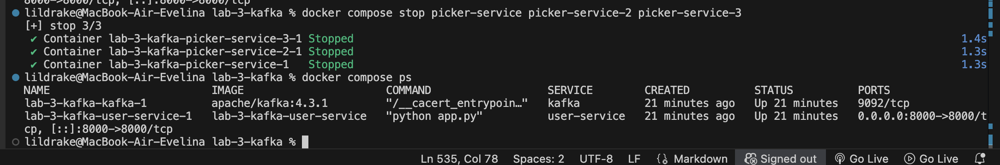

Перехожу на `http://127.0.0.1:8000/` и создаю несколько заказов:

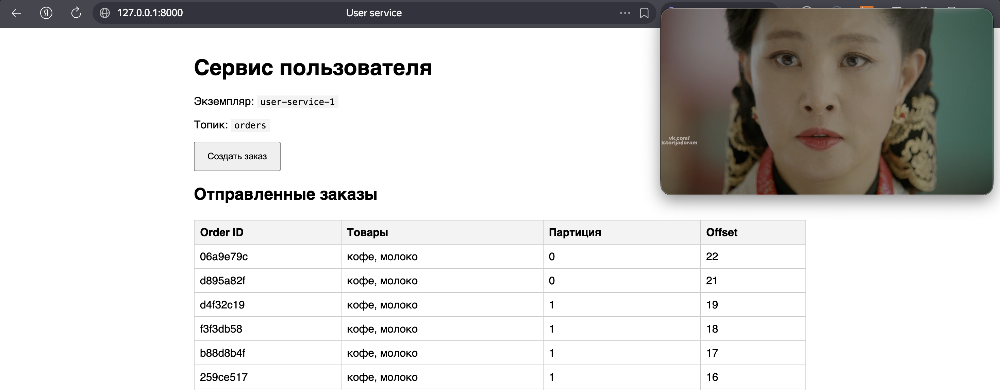

Чтобы посмотреть сообщения, я захожу в контейнер Kafka и перехожу в каталог `/opt/kafka/bin`. В этом каталоге находятся готовые команды для работы с Kafka, а не сами сообщения. Затем я запускаю `kafka-console-consumer.sh`, который подключается к брокеру и просит его показать сообщения из топика `orders`. Содержимое заказа создаёт `user-service`, а брокер Kafka сохраняет его, определяет партицию и назначает offset. Вывожу партицию - 0 и оффсет - 22:

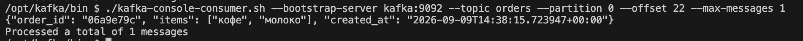

Вывод подтверждает, что сообщения действительно находятся в топике `orders` и Kafka может вернуть их сборщику.

Возвращаю сборщика и нахожу оффсет 22:

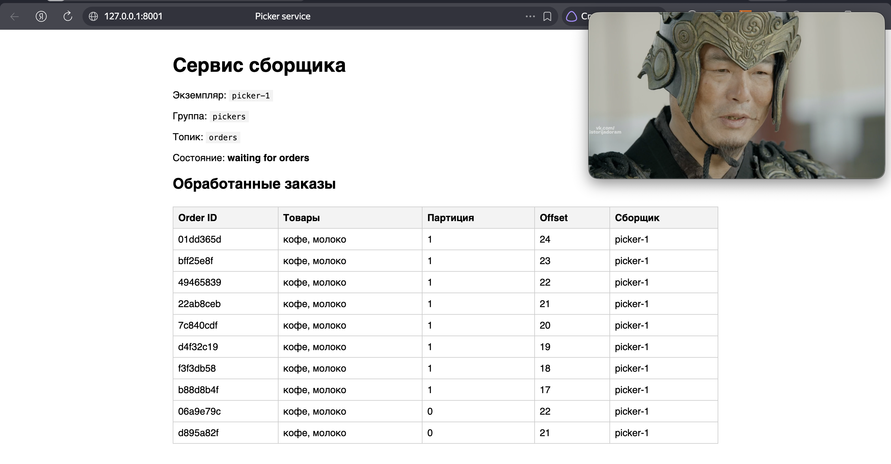

___________
# Часть 4 - Поднятие Kafka UI
Создаю в `docker-compose.yml` новый сервис `kafka-ui` и добавляю зависимость от `topic-manager`. Сам `topic-manager` ждёт готовности Kafka, после чего проверяет или создаёт топик `orders` и успешно завершает работу. Только после этого запускается Kafka UI.

Если не добавить зависимость, Kafka UI может запуститься одновременно с Kafka и попытаться подключиться по адресу `kafka:9092`, когда брокер ещё не готов принимать запросы. В этом случае интерфейс временно покажет кластер как недоступный, но позднее повторит подключение. Поэтому зависимость не является обязательной, но делает порядок запуска сервисов более понятным и предсказуемым:

```yml
kafka-ui:
  image: provectuslabs/kafka-ui:v0.7.1
  ports:
    - "8080:8080"
  environment:
    KAFKA_CLUSTERS_0_BOOTSTRAPSERVERS: kafka:9092
    KAFKA_CLUSTERS_0_NAME: local-kafka

depends_on: 
  topic-manager: 
    condition: 
      service_completed_successfully
```

Запускаю сервис `docker compose up -d kafka-ui`:

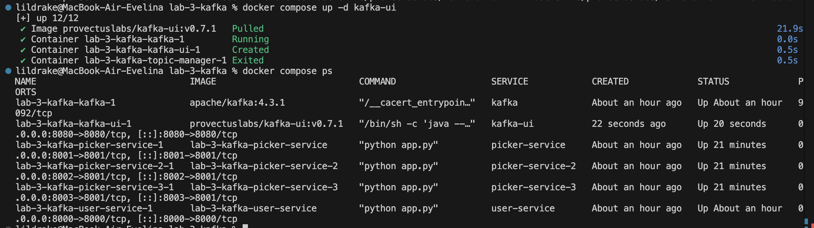

перехожу на адрес `http://127.0.0.1:8080` и нахожу `orders`:

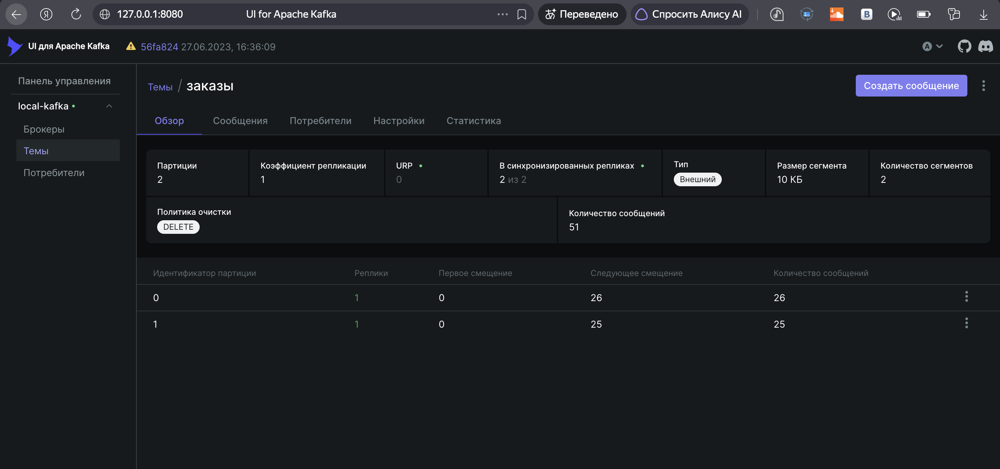

________
# Часть 5 - Бизнес-ситуации
### Бизнес ситуация №4
_________________

Создаю несколько заказов и смотрю на `order id` - `abf54c45`. Перехожу на Kafka UI, выбираю `Topics/orders`, перехожу на `messages` вставляю в поиск `abf54c45`, сообщение находится на партиции 0, оффсет 26.

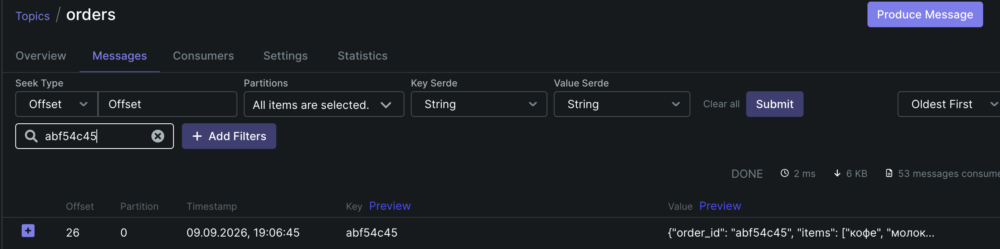

Перехожу во вкладку `consumers`, выбираю `pickers` и нахожу `offset` - 26, который обработал `consumer`:

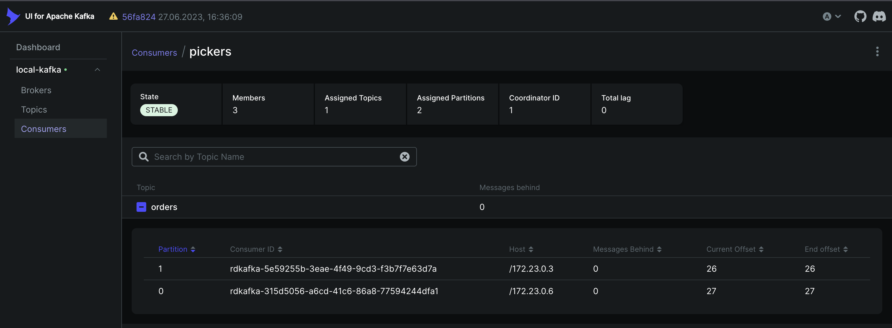

__________________
### Бизнес ситуация №5
_________________

Останавливаю всех сборщиков через `docker compose stop picker-service picker-service-2 picker-service-3`, затем на Kafka UI перехожу в `consumers`, выбиграю группу `pickers` и нажимаю `RESET OFFSETS`:

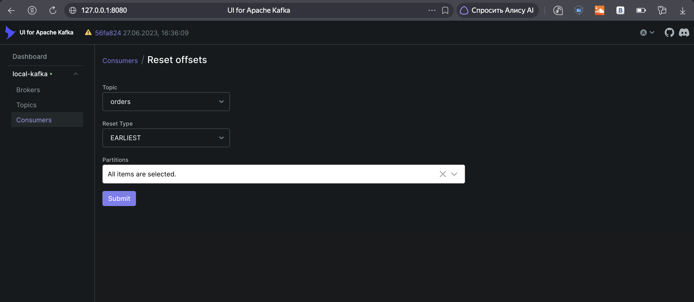

Открываю сервис сборки `http://127.0.0.1:8001/` и смотрю, как он заново собирает все заказы: 

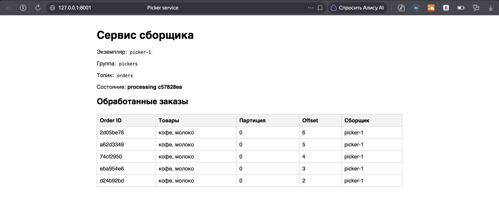

В Kafka повторная обработка возможна, потому что после чтения сообщения не удаляются из топика. Kafka хранит их в течение времени, заданного настройкой `retention`, а для группы потребителей сохраняет текущую позицию чтения `offset`. Если сбросить `offset` группы, сборщики снова прочитают все сообщения, которые ещё хранятся в топике. В обычной очереди сообщение после успешной обработки и отправки подтверждения `ack` обычно удаляется, поэтому повторно получить его из этой же очереди уже нельзя.

__________________
### Бизнес ситуация №6
_________________

В `docker-compose` для сервиса `topic-manager` уменьшаю значение до 1 минуты:

```yml
TOPIC_RETENTION_MS: "60000"
```

> также пришлось добавить строчки кода в app.py для топика, чтобы он замечал изменения не только партиций, но и retention

Перезапускаю сервис, отправляю 3 заказа, открываю kafka ui и по `order id` нахожу созданный заказ:  

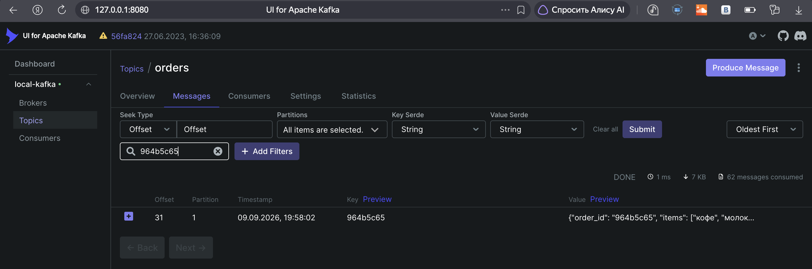

Дожидаюсь 1 минуты, перезагружаю страницу и можно увидеть, что все заказы удалились:

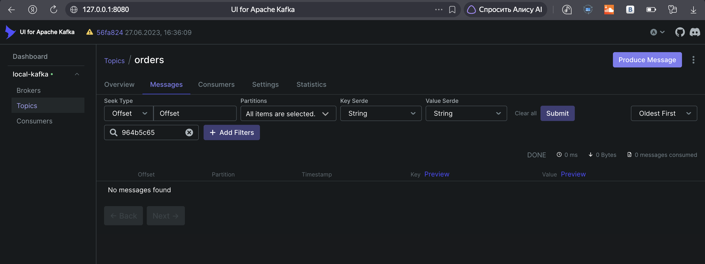

_______
# Часть 6 - Мониторинг

Создаю в docker-compose сервисы: `prometheus`, `grafana`, `alertmanager`, `webhook`, `kafka-exporter`. Добавляю в `volumes` тома для сервисов. Так как `prometheus` читает только в специально формате через HTTP, был добавлен `kafka-exporter`.
Также создаю три файла - `alert-rules`, `alertmanager`, `prometheus`.

Были созданы следующие правила мониторинга:

1. Первое правило - высокий `Consumer Lag`. Оно срабатывает, если в топике `orders` накапливается больше 10 необработанных сообщений. Рост этой метрики означает, что сборщики не успевают обрабатывать поступающие заказы. В таком случае можно увеличить количество потребителей, но это поможет только при наличии свободных партиций.

2. Второе правило — отсутствие активных сборщиков. Оно срабатывает, если в группе `pickers` не осталось ни одного потребителя. Kafka продолжит сохранять новые заказы, но обрабатывать их будет некому, поэтому очередь сообщений и время ожидания будут увеличиваться.

3. Третье правило — недоступность брокера Kafka. Оно срабатывает, если Kafka Exporter не обнаруживает ни одного брокера. Это критическая ситуация, потому что продюсер не сможет отправлять новые заказы в Kafka, а потребители не смогут получать их для обработки.

Поднимаю сервисы:

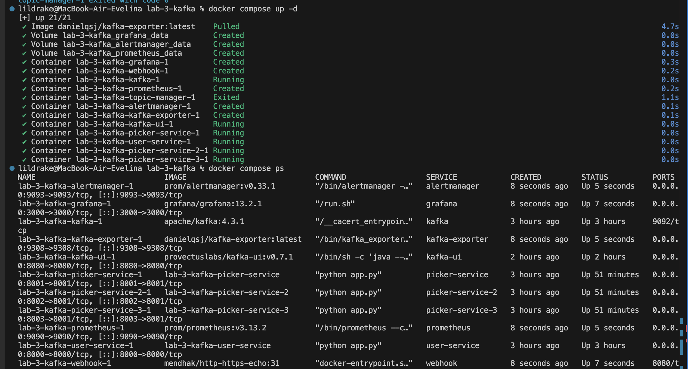

Захожу в прометеус и проверяю его правила:

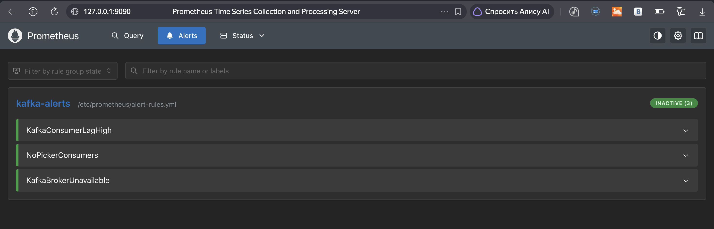

Проверяю заказы:

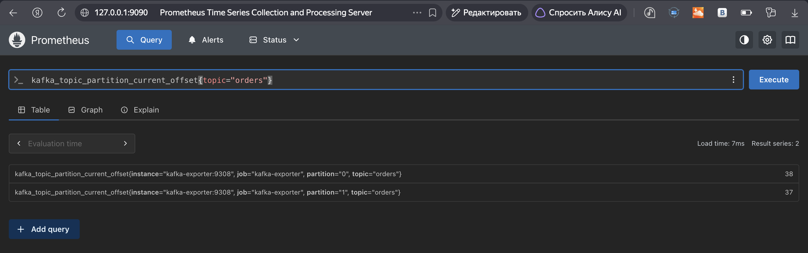


После подключения Prometheus к Grafana я создаю дашборд. На нём будут отображаться основные показатели работы Kafka и группы сборщиков.

Первой создаю панель `Количество брокеров Kafka` с запросом:

```promql
kafka_brokers or vector(0)
```

Для неё выбираю тип визуализации `Stat`, потому что мне нужно видеть одно текущее значение. В моей конфигурации используется один брокер, поэтому нормальным значением будет `1`. Если на панели появится `0`, значит Kafka Exporter не может обнаружить брокер или Kafka недоступна.

Второй создаю панель `Количество партиций orders` с запросом:

```promql
kafka_topic_partitions{topic="orders"} or vector(0)
```

Для неё также использую визуализацию `Stat`. Панель показывает, на сколько партиций разделён топик `orders`. Количество партиций важно, потому что оно ограничивает максимальное количество потребителей из одной группы, которые могут одновременно обрабатывать сообщения.

Третьей создаю панель `Активные сборщики` с запросом:

```promql
sum(kafka_consumergroup_members{consumergroup="pickers"}) or vector(0)
```

Эта панель показывает количество работающих потребителей в группе `pickers`. Для неё я выбираю визуализацию `Stat`. Если значение равно нулю, значит ни один сборщик не подключён к Kafka и новые заказы некому обрабатывать.

Четвёртой создаю панель `Необработанные заказы` с запросом:

```promql
sum(kafka_consumergroup_lag{consumergroup="pickers", topic="orders"}) or vector(0)
```

Панель показывает общий `Consumer Lag`, то есть количество сообщений, которые уже находятся в топике `orders`, но группа `pickers` ещё не успела обработать. Для неё я выбираю визуализацию `Stat`. Значение `0` означает, что все доступные заказы обработаны. Если значение постоянно растёт, значит сборщики не успевают за потоком заказов.

Пятой создаю панель `Consumer Lag по партициям` с запросом:

```promql
kafka_consumergroup_lag{consumergroup="pickers", topic="orders"}
```

Для неё выбираю визуализацию `Time series`, чтобы видеть изменение отставания во времени. Каждая линия соответствует отдельной партиции. Эта панель позволяет определить, в какой именно партиции накопились необработанные сообщения.

Шестой создаю панель `Offset партиций orders` с запросом:

```promql
kafka_topic_partition_current_offset{topic="orders"}
```

Для неё также выбираю визуализацию `Time series`. Панель показывает текущую позицию записи внутри каждой партиции. Когда создаются новые заказы, offset соответствующей партиции увеличивается. Так можно увидеть, что новые сообщения действительно поступают в Kafka. При этом панель не показывает содержимое заказов и их `order_id`, а отображает только числовые позиции сообщений внутри партиций.

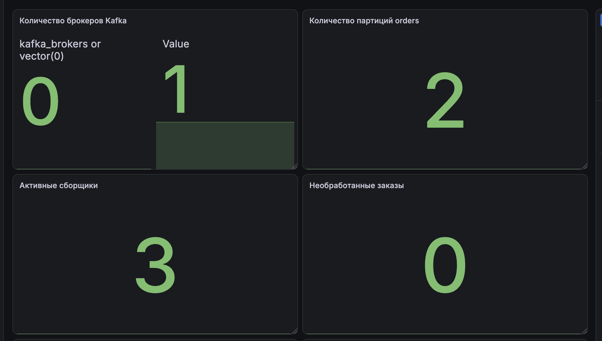

Создаю заказы:

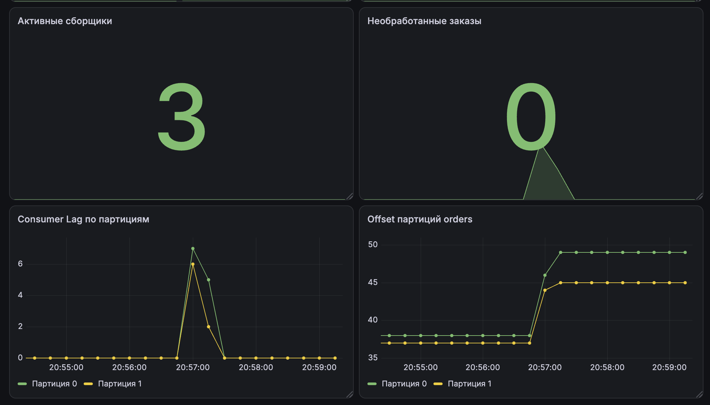

Для проверки работы правил, сначала останавливаю всех сборщиков `docker compose stop picker-service picker-service-2 picker-service-3` и смотрю в prometheus:

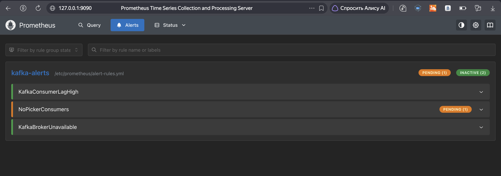

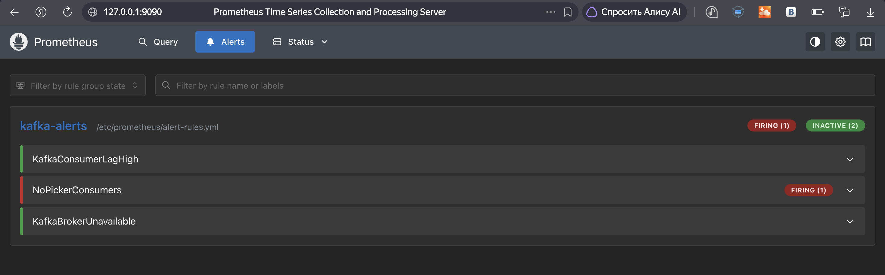

Проверяю дашборд в Grafana:

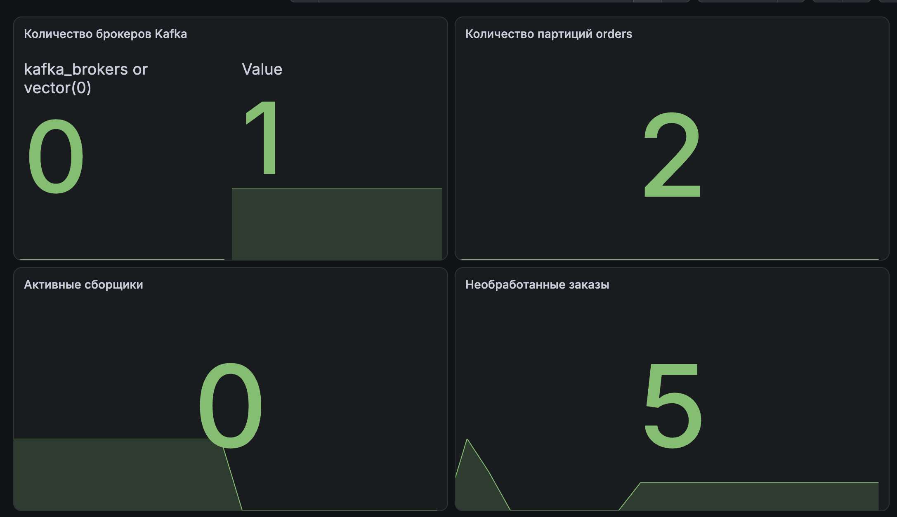

Создаю еще больше заказов и проверяю алерт KafkaConsumerLagHigh, он перешел в состояние `pending`, а затем в состояние `firing`. Командой `docker compose stop kafka` проверяю третий алерт, и он также перешел в состояние `firing`. 